[](https://github.com/getCompass/userbot/blob/master/README.md)
[](https://github.com/getCompass/userbot/blob/master/README_ru.md)

- [Chatbot](#Chatbot)
- [Creating a bot](#Creating-a-bot)
  - [Bot credentials](#Bot-credentials)
- [Sending a request to Compass](#Sending-a-request-to-Compass)
  - [Scheme for obtaining a signature for the request](#Scheme-for-obtaining-a-signature-for-the-request)
  - [Response from Compass after sending a request](#Response-from-Compass-after-sending-a-request)
  - [Getting the result of the sent request](#Getting-the-result-of-the-sent-request)
- [Webhook and responding to commands](#Webhook-and-responding-to-commands)
  - [Bot Webhook version](#Bot-Webhook-version)
- [Compass Userbot API methods](#Compass-Userbot-API-methods)
- [Additional message formatting](#Additional-message-formatting)
- [Errors in executing the Compass Userbot API request](#Errors-in-executing–the-Compass-Userbot-API-request)
- [Library for Compass Chatbot API](#Library-for-Compass-Chatbot-API)
## Chatbot ##

Chatbots are special accounts created to perform actions within the Compass application on behalf of the bot.

Our chatbot knows how to:
- Send a message to a user or to a group chat
- Add reactions to messages
- Send files to a chat
- Collect basic information on company members (user_id, name, URL of an avatar file)

The actions listed above are implemented through special requests described in [Compass Userbot API methods](#Compass-Userbot-API-methods).

Also, if you enable "Respond to commands" mode, the bot will start responding to commands that you specify and redirect them to your webhook address (more details in [Webhook and responding to commands](#Webhook-and-responding-to-commands)).

## Creating a bot ##

Creating a bot is available to a person who has a Programmer's role in the company.<br>
This role can be given by the company executive using the company menu (by clicking on the company name, then — "Settings", and then — "Set up roles"):

| 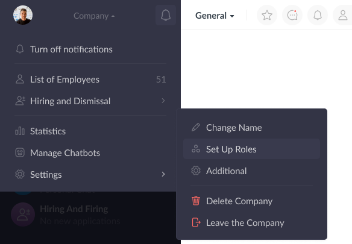 |
|-----------------------------------------|

| 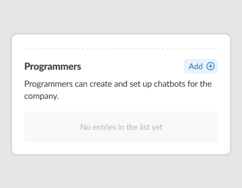 |
|-----------------------------------------|

After adding a role to a user, a new functionality for managing bots will appear in their menu:

| 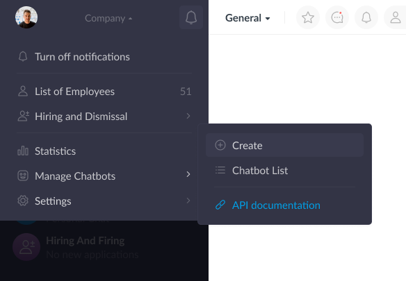 |
|------------------------------------------|

| 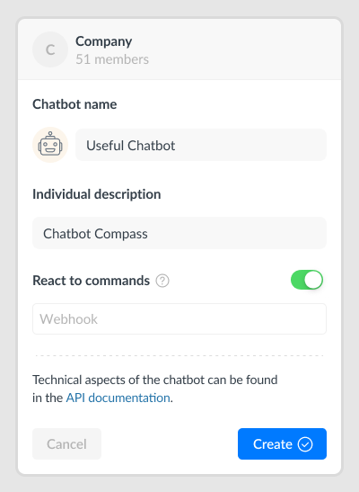 |
|------------------------------------------|

When creating a bot, you can set up the following:

- name of a new bot;
- description of what the bot is used for;
- webhook to which user commands will be redirected.<br>

Webhook is the URL of your service. After installing it, the bot is enabled to respond to the Programmer's commands by redirecting them to the address you specified.

| 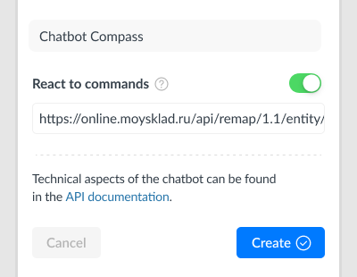 |
|-------------------------------------------|

#### Bot credentials
After creating a bot in the "Bot Card" section, you will get a **Token** and a **Signature Key** for the new bot (visible only to your company's Programmer).

**The bot token** is a unique identifier for each bot.

| 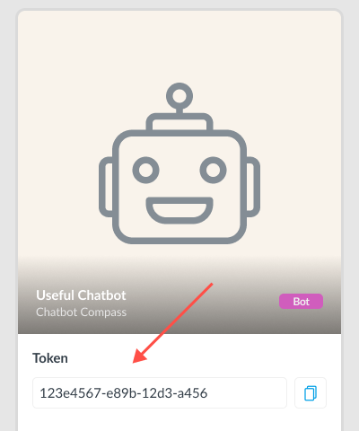 |
|------------------------------------------|

**The signature key** is the key for generating a signature, which is used to sign each sent request. It is required to confirm that the request was sent from your bot.

| 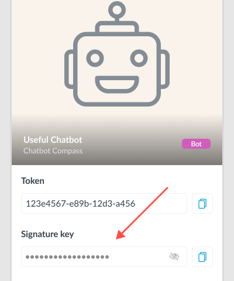 |
|-------------------------------------------|

⚠️ Warning: **Do not disclose your bot's Token and Signature Key** to the third parties.<br>
If this happens, it is recommended to change the signature key in the Compass application through the bot settings:

| 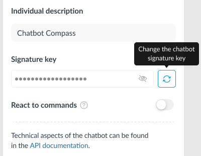 |
|------------------------------------------|

Thus, all bot requests that used the compromised signature key will become invalid for the Compass application.

## Sending a request to Compass ##

Requests to the Compass Userbot API must be sent via an HTTPS request by the POST method sent to endpoint: <br>
`https://userbot .getcompass.com/api/v2/` + (method being executed)<br>

All requests must use the content type: **application/json**.<br>
To upload files: **multipart/form-data**.

The body of each request to Compass must contain the following:
- **json string** of required parameters for the request (empty if no data is required).

Request authorization is done via **headers** using your bot's token and generated signature:<br>
- header "**Authorization: bearer={bot token}**" - the header contains a token that belongs to your bot (the bot must be enabled for this);
- header "**Signature: signature={generated signature}**" - a signature is passed in the header to validate the request data (for more information, see [Scheme for obtaining a signature for the request](#Scheme-for-obtaining-a-signature-for-the-request)).

All methods are case sensitive and must be UTF-8 encoded.

--- 

Let's consider a request using the example of sending a message to a user.

The  [/user/send](#post-usersend) method is used.<br>
URL for the request being sent: `https://userbot.getcompass.com/api/v2/user/send` <br>

Example parameters for a request:
```json5
{
  "text": "Hello, this is bot", // any text for a new message from the bot 
  "type": "text", // indicate that the message is a text 
  "user_id": 12345 // the ID of the user to whom the message is sent
}
```

Curl request structure:<br>
<pre style="white-space:pre-wrap;">
curl-X POST -d "<b>{parameters in json format}</b>"
-H "Content-Type: application/json"
-H "Authorization: bearer=<b>{bot token}</b>"
-H "Signature: signature=<b>{generated signature}</b>"
https://userbot.getcompass.com/api/v2/user/send
</pre>


---

The bot can send a message to the group of which it is a member, a particular user,
as well as in the thread to the message.

When sending a request, you need to specify where the message from the bot will be sent to:

- if you need to send it to a user, the ID of the user (the message receiver) is required;
- if you need to send it to a group, you need a unique key of this group;
- if you need to send it to a thread, you need the message key for which the thread will be created.

#### User ID

The user ID (the "user_id" parameter in requests) is used when sending a message to a specific user. It cn be found in the Compass app under "
Employee Card" (available only to members of your company with the "Programmer" role):

| 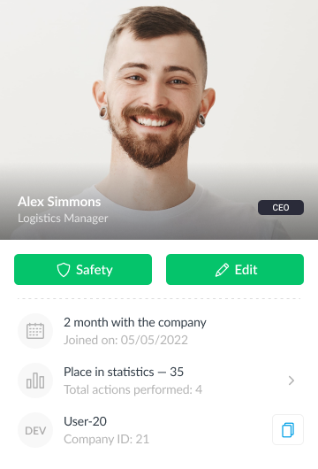 |
|------------------------------------------|

#### Chat Key

The unique identifier of the group (used as "group_id" in requests) of which the bot is a member.<br>
Available to a member with the "Programmer" role under "Chatbot Menu" in the group chat:

| 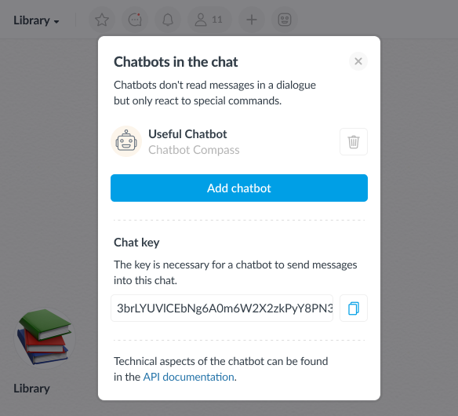 |
|------------------------------------------|

Example of a chat key:

> 3brLYUVlCEbNg6A0m6W2X2zkPyY8PN3Ijw6efI20gVJHGiy4xHOociXAmMh1o/i01gLTS8wHHx7JGrrzIL4zDC6a4qX031dzJfqTzl8MD6Rqv2wd38yfGLS6n6VlwmPQ2hNNXCDPEL9sddmYCfHSSY/BfjXsNvJh3YpBH1pRf1I=

#### Message Key

The identifier of a message (used as "message_id" in requests) that the bot is working with. Example of a chat key:
> oDT9FLRWjDOX0+4smgkCn039jKIce+NUE90zy9neDKvh6ubLMDGU/Cee5e07avTPFT/WcnAJIXFxBYmT8vqbF5vNIi4T/YEKZh4yF4iLXo9J4pW/4UguVkB0XY9/vF5pzUHUL4eVr3ScGWEP3fUEWdNlws+pffgp9oUOl+X0HrFxXxuFVfREy6od/psN+lob

---

#### Scheme for obtaining a signature for the request ####

To get a signature, follow these steps:

- for example, let's take a request to send a message from a bot to a specific user (the [/user/send](#post-usersend));
- specify parameters and values for the request body:
>```json5  
>{
>    "user_id": 12345,
>    "text": "Hello, this is bot",
>    "type": "text"
>}
>```
- convert the transmitted data to json format;
- get a json string of the following type: `{"user_id":12345,"text":"Hello, this is bot","type":"text"}`;
- combine the bot token strings and the resulting json string: `<bot token> + <received json string>`;
- after that, use the function to generate a hash string based on the encryption key using the HMAC hashing method and the SHA256 encryption algorithm.<br>
>**hash_hmac("sha256", <bot token> + <received json string>, <your bot's signature key>)**
>- hash_hmac is a function for generating a hash string based on your bot's signature key;
>- sha256 — the encryption algorithm used;

The received string is a signature that is passed in the header of the request:<br>
**Signature: signature={generated signature}**:

⚠️ Pay attention to the following:
- the received signature is **relevant only** for the current token, signature key, and request parameters. If one of them changes, it will be necessary
  to generate the signature again according to the same scheme.

---

#### Response from Compass after sending a request ####

The response is a json object that contains the fields:
- **status** (string) — is for the status of the request execution.<br>
  It can take the value "ok" (in case the request was executed successfully) or "error" (in case of an error);
- **response** (json) — is a json object of arbitrary data.

If successful, the response field may have the data of the executed request, or an empty value.

**Example of a response with returned data:**
```json5 
{
    "status": "ok",
    "response": {
        "request_id": "fb32d289-2ec2-46b7-8116-ad3c4adeaa61"
    }
}
```

**Example of an empty response:**
```json5 
{
    "status": "ok",
    "response": {}
}
```

If an error has occurred, the **status** field will take the value "error".<br>
In this case, the **response** field will contain the fields:
- **error_code** (int) — error code. For more details, see the section [Errors when executing the Compass Usbot API request](#Errors-when-executing-the-Compass-Usbot-API-request);
- **message** (string) — arbitrary error text.

**Example of an error response:**
```json5 
{
    "status": "error",
    "response": {
        "error_code": 1000,
        "message": "invalid parameters: not passed param text for request"
    }
}
```

#### Getting the result of the sent request ####

All requests to Compass, except for the [/request/get](#post-requestget) method and file upload, are executed asynchronously.<br>
Therefore, after executing the request, it is necessary to get the result by the received identifier — `request_id`.
This is the unique identifier of the request being executed in the Compass application.

After successfully sending a request to Compass, you can request the result of execution with a 0.5 seconds interval using the [/request/get](#post-requestget).<br>

Let's look at the scheme of getting the result by the example of sending a message from a bot:
- execute the [/user/send](#post-usersend), request by sending the text: Hello, this is bot :blush:
- the request response will contain its `request_id`:
```json5 
{
    "status": "ok",
    "response": {
        "request_id": "fb32d289-2ec2-46b7-8116-ad3c4adeaa61"
    }
}
```
- at this moment, the request is taken for processing to send a message to the user on behalf of the bot;
- calling the [/request/get](#post-requestget) method with sending `request_id` will return the state of the specified request:
> If the request is still in progress:
>
>```json5 
>{
>    "status": "error",
>    "response": {
>        "error_code": 7,
>        "message": "the request has not yet been completed, please try again in a while"
>    }
>}
>```
- such a response means that the request has not been executed yet — it is enough to wait a little (we recommend an interval of no more than 0.5 seconds), then re-request the result using [/request/get](#post-requestget);
- if the message is successfully sent, the method will return the result of executing the request — in this example, it is the message_id of the message sent by the bot:
>```json5
>{
>     "status": "ok",
>     "response": {
>          "message_id": "eNb2VLAPCGFfK1gHzNkH78XNDsPr9N/dDI7f/yaeTof0zjXwv/G000SZFNwqBOx2ACjqSwFjB1Lhgtqn..."
>     }
>}
>```

| 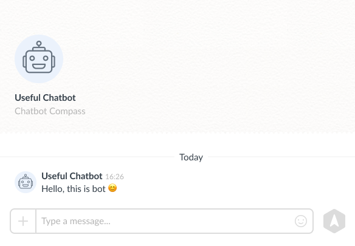 |
|------------------------------------------|

## Webhook and responding to commands

The bot can respond to special commands added by the Programmer using the [/command/update](#post-commandupdate):

| 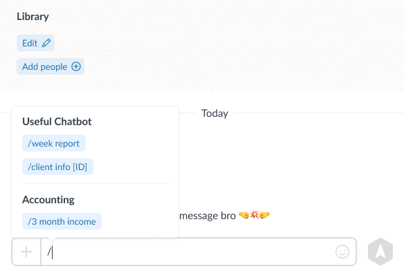 |
|------------------------------------------|

The preset commands will be visible to each company member under "Bot Card" section:

| 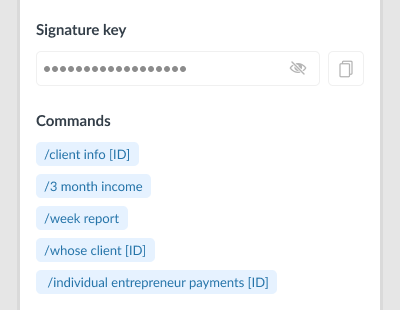 |
|------------------------------------------|

When a user sends a command to a bot with "Respond to commands" mode enabled, and a webhook is installed, the data of the following form is sent to the specified address:

> If the command was sent in a group chat
>
>```json5 
>{
>    "group_id": "3brLYUVlCEbNg6A0m6W2X2zkPyY8PN3Ijw6efI20gVJHGiy4xHOociXAmMh1o/i01gLTS8wHHx7JGrrzIL4z...",
>    "message_id": "oDT9FLRWjDOX0+4smgkCn039jKIce+NUE90zy9neDKvh6ubLMDGU/Cee5e07avTPFT/WcnAJIXFxBYmT8vqbF5vNIi4T/YEKZh...",
>    "text": "/show command list"
>    "type": "group",
>    "user_id": 12345,
>}
>```

- group_id — is for the key of the group chat from which the command was sent;
- message_id — is for the unique identifier of the command;
- text — is for the text of the command sent to the bot;
- type — indicates where the command came from (single — private chat with the bot; group — group chat);
- user_id — is for the identifier of the Compass app user who sent the command.

> If the command was sent in a private chat with the bot
>
>```json5 
>{
>     "group_id": "",
>     "message_id": "oDT9FLRWjDOX0+4smgkCn039jKIce+NUE90zy9neDKvh6ubLMDGU/Cee5e07avTPFT/WcnAJIXFxBYmT8vqbF5vNIi4T/YEKZh...",
>     "text": "/show command list"
>     "type": "single",
>     "user_id": 12345,
>}
>```

⚠️ Please note: only those messages are sent to your service, the text of which matches the template of commands prescribed by your company's Programmer. **Other messages from the chat are not sent to the webhook**.

The request will be signed with a header using the token of the bot to which the sent command belongs:<br>
>header "**Authorization: bearer={bot token}**".<br>

The request will also contain a header with the generated signature for the data being sent (created according to the standard signature [receipt scheme](#receipt-scheme)):<br>
>the title "**Signature: signature={generated signature}**".<br>

After receiving the data on your webhook, you can:
- check by token that the request came for your bot;
- generate a signature, then compare it with the hash string in the "Signature" header. If the strings match, you can thereby make sure that the data was sent from the Compass application, and not by third parties.

#### Bot Webhook version

Each Compass chatbot has a webhook version that allows for more flexible interaction with the Userbot API when API changes.<br>

Let's take an example:<br>
In the new version of the Usbot API, the format of data sent to your webhook address has changed, for example, a new chat type has appeared:
>type: "group/single/ **(new) channel**"

In this case, the bot you used before the changes will have a webhook version that the new changes will not affect, and data of a format known to you will be sent to your webhook address.<br>
After the new changes are taken into account on your part, you can use the [/webhook/setVersion](#post-webhooksetversion) method to switch the version of the webhook to the current one.

## Compass Userbot API methods

| Method | What is it used for                                |
| :--- |:---------------------------------------------------|
| [/request/get](#post-requestget) | get the result of executing the request.           |
| [/user/send](#post-usersend) | send a message from the bot to a specific user.    |
| [/group/send](#post-groupsend) | send a message from the bot to the group chat.     |
| [/thread/send](#post-threadsend) | send a message from the bot to the thread.         |
| [/message/addReaction](#post-messageaddreaction) | add a reaction to the message on behalf of the bot.|
| [/message/removeReaction](#post-messageremovereaction) | remove the bot's reaction from the message.                  |
| [/user/getList](#post-usergetlist) | get data about the company members.            |
| [/group/getList](#post-groupgetlist) | get the data of the groups that the bot is a member of.      |
| [/command/update](#post-commandupdate) | update the list of bot commands.                       |
| [/command/getList](#post-commandgetlist) | get a list of bot commands.                       |
| [/webhook/setVersion](#post-webhooksetversion) | install the version for the bot webhook.                |
| [/webhook/getVersion](#post-webhookgetversion) | get the current version of the bot webhook.              |
| [/file/getUrl](#post-filegeturl) | get the URL for uploading files.                  |

## Description of methods

### `POST /request/get`

A method for getting the result of the sent request.<br>
URL for the request: `https://userbot.getcompass.com/api/v2/request/get` <br>

If successful, the result of executing the request will be returned.<br>
The following parameters must be specified in the request body:

| Name | Type | Property | Description | 
| -------- | --- | --- | -------- |
| request_id | string | required | ID of the request sent to the Compass app. |

<details><summary>Sample data for the request body and execution result</summary>
<br>

Data for the request body:
```json5 
{"request_id": "2f991a80-750c-4abc-b7e1-1f16456de59d"}
```

The result of executing the request (for example, information about the company's participants was requested)
```json5 
{
     "status": "ok",
     "response": {
          "user_list": [
               {
                    "user_id": 1,
                    "user_name": "John Dow",
                    "avatar_file_url": ""
               },
               {
                    "user_id": 2,
                    "user_name": "Mike Johnson",
                    "avatar_file_url": "https://file-1.getcompass.com/files/pivot/dca/e8d/632/fa7/51f/fdcaee3ecea91e6c_w400.jpeg"
               }
          ]
     }
}
```

</details>

List of possible errors:

| error_code | Meaning |
| --- | --- |
| 7 | the request has not been completed yet, please try again after a while. |
| 1000 | incorrect data was transferred (for example, the request_id parameter, which is missing from the database). |

---

### `POST /user/send`

A method for sending a message from a bot to a user.<br>
URL for the request: `https://userbot.getcompass.com/api/v2/user/send`

The following parameters must be specified in the request body:

| Name | Type | Property | Description |
| -------- | --- | --- | -------- |
| user_id | int | required | the ID of the user to whom the bot will send a message in a private chat. |
| text | string | required if the file_id parameter is not transferred | the text of the bot message. |
| file_id | string | required if the text parameter is not transferred | the file identifier for a file message.<br> See more about file_id in [this section](#post-filegeturl). |
| type | string | required | for text messages, the value = "text" must be sent to this parameter.<br>for file messages, the value = "file" must be sent to this parameter. |

The method's response will return the `request_id` of the request that is executed asynchronously. The execution result can be obtained using the [/request/get](#post-requestget) method.<br>

result of this method will be:<br>
message_id (string) — the key of the message sent by the bot.

<details><summary>Sample data for the request body and execution result</summary>
<br>

Data for the request body:
```json5 
{
     "text": "Hi, this is a message from a bot",
     "type": "text",
     "user_id": 12345
}
```

Request execution result:
```json5 
{
     "status": "ok",
     "response": {
          "message_id": "eNb2VLAPCGFfK1gHzNkH78XNDsPr9N/dDI7f/yaeTof0zjXwv/G000SZFNwqBOx2ACjqSwFjB1Lhgtqn..."
     }
}
```

</details>

List of possible errors:

| error_code | Meaning |
| --- | --- |
| 7 | the request has not been completed yet, please try again after a while. |
| 1000 | incorrect data were sent (for example, one of the parameters was not transmitted). |
| 1001 | the selected user does not exist in the company. |
| 1002 | the selected user has left the company. |

---

### `POST /group/send`

A method for sending a message from a bot to a group.<br>
URL for the request: `https://userbot.getcompass.com/api/v2/group/send`

The following parameters must be specified in the request body:

| Name | Type | Property | Description |
| -------- | --- | --- | -------- |
| group_id | string | required | ID of the group to which the bot will send the message. |
| text | string | required if the file_id parameter is not transferred | the text of the bot message. |
| file_id | string | required if the text parameter is not transferred | the file identifier for a file message.<br> See more about file_id in [this section](#post-filegeturl). |
| type | string | required | for text messages, the value = "text" must be sent to this parameter.<br>for file messages, the value = "file" must be sent to this parameter. |

The method's response will return the `request_id` of the request that is executed asynchronously. The execution result can be obtained using the [/request/get](#post-requestget) method.<br>The
result of this method will be:<br>
message_id (string) — the key of the message sent by the bot to the group.

<details><summary>Sample data for the request body and execution result</summary>
<br>

Data for the request body:
```json5 
{
     "group_id": "GrrzIL4zDC6a4qX031dzJfqTzl8MD6Rqv2wd38yfGLS6n3brLYUVlCEbNg6A0m6W2X2zkPyY8PN3Ijw6e...",
     "text": "Hi, this is a message from a bot to a group",
     "type": "text"
}
```

Request execution result:
```json5 
{
     "status": "ok",
     "response": {
          "message_id": "eNb2VLAPCGFfK1gHzNkH78XNDsPr9N/dDI7f/yaeTof0zjXwv/G000SZFNwqBOx2ACjqSwFjB1LhgtqnmXFReGjz..."
     }
}
```

</details>

List of possible errors:

| error_code | Meaning |
| --- | --- |
| 7 | the request has not been completed yet, please try again after a while. |
| 1000 | incorrect data were sent (for example, one of the parameters was not transmitted). |
| 1003 | the bot is not in a group chat. |
| 1004 | there is no such group chat. |

---

### `POST /thread/send`

A method for sending a message from a bot to a thread.<br>
URL for the request: `https://userbot.getcompass.com/api/v2/thread/send`

The following parameters must be specified in the request body:

| Name | Type | Property | Description |
| -------- | --- | --- | -------- |
| message_id | string | required | the identifier of the command for which the thread will be created, if it has not been created before, and a message from the bot is sent to this thread. |
| text | string | required if the file_id parameter is not transferred | the text of the bot message. |
| file_id | string | required if the text parameter is not transferred | the file identifier for a file message.<br> See more about file_id in [this section](#post-filegeturl). |
| type | string | required | for text messages, the value = "text" must be sent to this parameter.<br>for file messages, the value = "file" must be sent to this parameter. |

The method's response will return the `request_id` of the request that is executed asynchronously. The execution result can be obtained using the [/request/get](#post-requestget) method.<br>
The result of this method will be:<br>
message_id (string) — the key of the message sent by the bot to the thread.

<details><summary>Sample data for the request body and execution result</summary>
<br>

Data for the request body:
```json5 
{
     "message_id": "oDT9FLRWjDOX0+4smgkCn039jKIce+NUE90zy9neDKvh6ubLMDGU/Cee5e07avTPFT/WcnAJIXFx...",
     "text": "Hi, this is a message from a bot in the thread",
     "type": "text"
}
```

Request execution result:
```json5 
{
     "status": "ok",
     "response": {
          "message_id": "eNb2VLAPCGFfK1gHzNkH78XNDsPr9N/dDI7f/yaeTof0zjXwv/G000SZFNwqBOx2ACjqSwFj..."
     }
}
```

</details>

List of possible errors:

| error_code | Meaning |
| --- | --- |
| 7 | the request has not been completed yet, please try again after a while. |
| 1000 | incorrect data were sent (for example, one of the parameters was not transmitted). |
| 1005 | the bot does not have access to the message (the message has been deleted or the chat has been cleared). |
| 1007 | the transmitted message ID does not exist. |

---

### `POST /message/addReaction`

A method for adding a reaction to a message on behalf of a bot.<br>
URL for the request: `https://userbot.getcompass.com/api/v2/message/addReaction`

The Compass app supports a list of reactions of version 14.0: https://emojipedia.org/emoji-14.0/. <br>

The following parameters must be specified in the request body:

| Name | Type | Property | Description |
| -------- | --- | --- | -------- |
| message_id | string | required | identifier of the message to which the reaction is added on behalf of the bot. |
| reaction | string | required | the reaction that needs to be added.<br>Can take the value:<br>- short description (short_name). For example, `:blush:`<br>- emoji. For example, 😊 |

The method's response will return the `request_id` of the request that is executed asynchronously. The execution result can be obtained using the [/request/get](#post-requestget) method.<br>The
result of this method will be a standard "ok" response with no data returned.

<details><summary>Sample data for the request body and execution result</summary>
<br>

Data for the request body:
```json5 
{
     "message_id": "oDT9FLRWjDOX0+4smgkCn039jKIce+NUE90zy9neDKvh6ubLMDGU/Cee5e07avTPFT/WcnAJIXFxBYmT8v...",
     "reaction": ":blush:"
}
```

Request execution result:
```json5 
{
     "status": "ok",
     "response": {}
}
```

</details>

List of possible errors:

| error_code | Meaning |
| --- | --- |
| 7 | the request has not been completed yet, please try again after a while. |
| 1000 | incorrect data were sent (for example, one of the parameters was not transmitted). |
| 1005 | the bot does not have access to the message (the message has been deleted or the chat has been cleared). |
| 1006 | the transmitted reaction is missing in the application. |
| 1007 | the transmitted message ID does not exist. |

---

### `POST /message/removeReaction`

A method for removing the bot's reaction from a message.<br>
URL for the request: `https://userbot.getcompass.com/api/v2/message/removeReaction`

The Compass app supports a list of reactions of version 14.0: https://emojipedia.org/emoji-14.0/. <br>

The following parameters must be specified in the request body:

| Name | Type | Property | Description |
| -------- | --- | --- | -------- |
| message_id | string | required | identifier of the message from which the bot's reaction will be removed. |
| reaction | string | required | the reaction that needs to be removed.<br>Can take the value:<br>- short description (short_name). For example, `:blush:`<br>- emoji. For example, 😊 |

The method's response will return the `request_id` of the request that is executed asynchronously. The execution result can be obtained using the [/request/get](#post-requestget) method.<br>
The result of this method will be a standard "ok" response with no data returned.

<details><summary>Sample data for the request body and execution result</summary>
<br>

Data for the request body:
```json5 
{
     "message_id": "oDT9FLRWjDOX0+4smgkCn039jKIce+NUE90zy9neDKvh6ubLMDGU/Cee5e07avTPFT/WcnAJIXFxBYmT8v...",
     "reaction": ":blush:"
}
```

Request execution result:
```json5 
{
     "status": "ok",
     "response": {}
}
```

</details>

List of possible errors:

| error_code | Meaning |
| --- | --- |
| 7 | the request has not been completed yet, please try again after a while. |
| 1000 | incorrect data were sent (for example, one of the parameters was not transmitted). |
| 1005 | the bot does not have access to the message (the message has been deleted or the chat has been cleared). |
| 1006 | the transmitted reaction is missing in the application. |
| 1007 | the transmitted message ID does not exist. |

---

### `POST /user/getList`

A method for obtaining data about the company members.<br>
URL for the request: `https://userbot.getcompass.com/api/v2/user/getList`

The following parameters can be used in the request body:

| Name | Type | Property | Description |
| -------- | --- | --- | -------- |
| count | int | _optional_ | the number of data in the response. Default = 100.<br>Maximum = 300. |
| offset | int | _optional_ | offset for data pagination. Default = 0. |

The method's response will return the `request_id` of the request that is executed asynchronously. The execution result can be obtained using the [/request/get](#post-requestget) method.<br>
The result of this method will be:<br>
user_list (array) — a list with information on company members.

<details><summary>Sample data for the request body and execution result</summary>
<br>

Data for the request body:
```json5 
{"count": 300, "offset": 0}
```

Request execution result:
```json5 
{
     "status": "ok",
     "response": {
          "user_list": [
               {
                    "user_id": 1,
                    "user_name": "John Dow",
                    "avatar_file_url": ""
               },
               {
                    "user_id": 2,
                    "user_name": "Mike Johnson",
                    "avatar_file_url": "https://file-1.getcompass.com/files/pivot/dca/e8d/632/fa7/51f/fdcaee3ecea91e6c_w400.jpeg"
               }
          ]
     }
}
```

</details>

List of possible errors:

| error_code | Meaning |
| --- | --- |
| 7 | the request has not been completed yet, please try again after a while. |

---

### `POST /group/getList`

A method for obtaining information about the groups in which the bot is a member.<br>
URL for the request: `https://userbot.getcompass.com/api/v2/group/getList`

The following parameters can be used in the request body:

| Name | Type | Property | Description |
| -------- | --- | --- | -------- |
| count | int | _optional_ | the number of data in the response. Default = 100.<br>Maximum = 300. |
| offset | int | _optional_ | offset for data pagination. Default = 0. |

The method's response will return the `request_id` of the request that is executed asynchronously. The execution result can be obtained using the [/request/get](#post-requestget) method.<br>
The result of this method will be:<br>
group_list (array) — a list with information on the bot's group chats.

<details><summary>Sample data for the request body and execution result</summary>
<br>

Data for the request body:
```json5 
{"count": 50, "offset": 0}
```

Request execution result:
```json5 
{
     "status": "ok",
     "response": {
          "group_list": [
               {
                    "group_id": "kPyY8PN3Ijw6efI20gVJHGiy4xHOociXAmMh1o/i01gLTS8wHHx7JGrrzIL4zDC6a4qX031dzJfqTzl8MD6Rqv2wd38...",
                    "name": "Library",
                    "avatar_file_url": "https://file-1.getcompass.com/files/c1/cba/30i/de0/2ff/uf3/4128e05b1cbd1f79_w80.jpg"
               },
               {
                    "group_id": "GrrzIL4zDC6a4qX031dzJfqTzl8MD6Rqv2wd38yfGLS6n3brLYUVlCEbNg6A0m6W2X2zkPyY8PN3Ijw6efI20gVJHG...",
                    "name": "Schedule",
                    "avatar_file_url": "https://file-1.getcompass.com/files/c1/cde/b4s/duo/1fc/97t/4128e05b1cbd1f79_w80.jpg"
               },
               {
                    "group_id": "3brLYUVlCEbNg6A0m6W2X2zkPyY8OociXAmMh1o/i01gLTS8wHHx7JGrrzIL4zDC6a4qX031dzJfqTzl8MD6Rqv2wd...",
                    "name": "Statistics",
                    "avatar_file_url": "https://file-1.getcompass.com/files/c1/adf/a1e/pra/4ca/mt5/4128e05b1cbd1f79_w80.jpg"
               }
          ]
     }
}
```

</details>

List of possible errors:

| error_code | Meaning |
| --- | --- |
| 7 | the request has not been completed yet, please try again after a while. |

---

### `POST /command/update`

Method for updating the list of bot commands.<br>
URL for the request: `https://userbot.getcompass.com/api/v2/command/update`

The following parameters must be specified in the request body:

| Name | Type | Property | Description |
| -------- | --- | --- | -------- |
| command_list | array | required | a new list of command lines for the bot (maximum 30 commands for the bot). |

A few rules for setting commands:

- the length of the command must not exceed 80 characters;
- the command can have parameters enclosed in square brackets. In this case, the pattern for defining commands for the bot will "ignore" them during
  processing, counting them as the passed parameter.<br>For
  example, a bot in the list of commands has the command: "send a message to the user [ID]". If the message "/send message to
  user [1666]" is sent to the chat, the parser will define it as a command.
- commands can contain Russian and Latin alphabet symbols, numbers and an underscore. A few examples:
> /help
>
> /client info [ID]
>
> /set_timer 10min

The method's response will return the `request_id` of the request that is executed asynchronously. The execution result can be obtained using the [/request/get](#post-requestget) method.<br>
The result of this method will be a standard "ok" response with no data returned.

<details><summary>Sample data for the request body and execution result</summary>
<br>

Data for the request body:
```json5 
{
     "command_list": [
          "/help",
          "/send message to user [ID]"
     ]
}
```

Request execution result:
```json5 
{
     "status": "ok",
     "response": {}
}
```

</details>

List of possible errors:

| error_code | Meaning |
| --- | --- |
| 7 | the request has not been completed yet, please try again after a while. |
| 1000 | incorrect data was transmitted (the length for the command was exceeded). |
| 1008 | the limit of the command list has been exceeded. |
| 1009 | invalid command in the list. |

---

### `POST /command/getList`

Method for getting a list of bot commands.<br>
URL for the request: `https://userbot.getcompass.com/api/v2/command/getList`

Parameters **are not required** to be sent in the request body.

The method's response will return the `request_id` of the request that is executed asynchronously. The execution result can be obtained using the [/request/get](#post-requestget) method.<br>
The result of this method will be:<br>
command_list (array) — list of bot commands.

<details><summary>Example of request execution result</summary>

```json5 
{
     "status": "ok",
     "response": {
          "command_list": [
               "/help",
               "/send message to user [ID]"
          ]
     }
}
```

</details>

List of possible errors:

| error_code | Meaning |
| --- | --- |
| 7 | the request has not been completed yet, please try again after a while. |

---

### `POST /webhook/setVersion`

A method for setting the version level of the bot webhook.<br>
URL for the request: `https://userbot.getcompass.com/api/v2/webhook/setVersion`

The following parameters must be specified in the request body:

| Name | Type | Property | Description |
| -------- | --- | --- | -------- |
| version | int | required | the version number for the bot webhook. |

The method's response will return the `request_id` of the request that is executed asynchronously. The execution result can be obtained using the [/request/get](#post-requestget) method.<br>
The result of this method will be a standard "ok" response with no data returned.

<details><summary>Sample data for the request body and execution result</summary>
<br>

Data for the request body:
```json5 
{"version": 2}
```

Request execution result:
```json5 
{
     "status": "ok",
     "response": {}
}
```

</details>

List of possible errors:

| error_code | Meaning |
| --- | --- |
| 7 | the request has not been completed yet, please try again after a while. |
| 1000 | incorrect data was transmitted. |
| 1011 | an incorrect version of the webhook was transmitted. |

---

### `POST /webhook/getVersion`

A method for getting the webhook version level of the bot.<br>
URL for the request: `https://userbot.getcompass.com/api/v2/webhook/getVersion`

Parameters are **not required** to be sent in the request body.

The result of this method will be:<br>
version (int) — the version level of the bot webhook.

<details><summary>Example of request execution result</summary>

```json5 
{
     "status": "ok",
     "response": {
          "version": 2
     }
}
```

</details>

---

### `POST /file/getUrl`

A method for getting the URL node where the files are uploaded.

It is intended for further obtaining the file_id parameter for sending a message file.<br>
URL for the request: `https://userbot.getcompass.com/api/v2/file/getUrl`

Parameters are **not required** to be sent in the request body.

The method's response will return the `request_id` of the request that is executed asynchronously. The execution result can be obtained using the [/request/get](#post-requestget) method.<br>
The result of this method will be:<br>
node_url — is the URL of the server to which the file can be uploaded;<br>
file_token — is a token for validating the file upload request.

<details><summary>Example of request execution result</summary>

```json5 
{
     "status": "ok",
     "response": {
          "node_url": "https://file1.getcompass.com/api/userbot/files/upload",
          "file_token": "404952d4ac90ae960de4d2a96fb95d306493e151"
     }
}
```

</details>

---

After receiving the server URL, it will be possible to upload the file as a composite request using [multipart/form-data](https://ru.wikipedia.org/wiki/Multipart/form-data), signing the request with the received file token.

In our case, with the node_url and the file upload token received from the response, the request will look like this:<br>
URL for the request: `https://file1.getcompass.com/api/userbot/files/upload`

| Name | Type | Property | Description |
| -------- | --- | --- | -------- |
| token | string | required | a token for validating the file upload. |
| file | string/binary | required | the contents of the file to upload. |

⚠️ File Upload restrictions:

- the maximum file size is 256MB;
- one token allows uploading one file — the second file cannot be uploaded using it;
- no more than 50 files are available for upload in 5 minutes.

After successful file upload (synchronous execution — the file will be uploaded immediately), the response from the method will return:<br>
file_id (string) is the unique identifier of the uploaded file.

<details><summary>Example of the request and the result of the request</summary>

Request example:
```json5 
token: "404952d4ac90ae960de4d2a96fb95d306493e151", // value of the received file_token
file: "(binary)"                                   // binary data of the uploaded file
```

Request execution result:
```json5 
{
     "status": "ok",
     "response": {
          "file_id": "+OVV/dHD03Pb/qRQz9W/FhgupqO6UY0lmbwnG5tz9mHW51N8gA10VvotOzq01GuWq/c5LGZSldSCz4aki..."
     }
}
```

</details>

List of possible errors:

| error_code | Meaning |
| --- | --- |
| 7 | the request has not been completed yet, please try again after a while. |
| 1000 | incorrect data was transmitted. |
| 1010 | the file could not be uploaded. |

---

### Additional message formatting

The bot has a functionality that allows you to mention the user in the sent message:

| 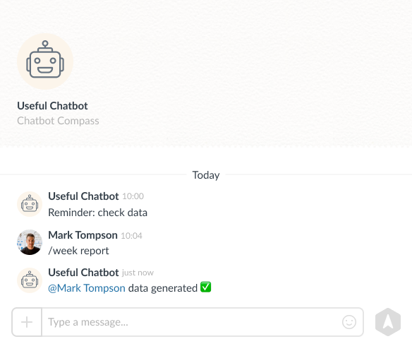 |
|------------------------------------------|

To do this, the message text must have the format of:<br>
`["@"|<numeric identifier user_id>|<username>|]`

With the example above, let's take that Fred Smith has a user ID 345. To receive a message, as in the example, the text of the message sent from the bot must have the following form:<br>
`["@"|345|Fred Smith] data generated ✅`

---

The bot also has the same message formatting functions as the Compass user.<br>For
example, change the font style or highlight words with a certain color:
- bold text font: *bold font*
- italics in the text: _cursive_
- strikethrough text: \~strikethrough text\~
- text on a black background: \`text on a black background\`
- text highlighted in green: \++green selection\++
- text highlighted in red: \--red selection\--

| 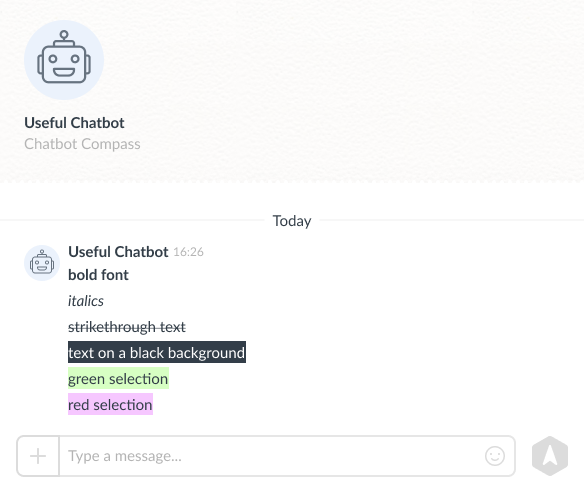 |
|------------------------------------------|


## Errors in executing the Compass Userbot API request

If an error occurred during the execution of the request, the response is returned in the following format:

```json5 
{
     "status": "error",
     "response": {
          "error_code": 1,
          "message": "missing required fields for request"
     }
}
```
- status "error" — notifies that the request failed with an error;
- error_code — is for special error code;
- message — is for any text to describe the error.

---

A list of **system errors** when trying to execute a request. They are returned when incorrect request data is transmitted and if the request has not yet been executed.

| error_code | Описание |
| --- | --- |
| 1 | there are no required fields for the request. |
| 2 | the request token was not found. |
| 3 | the bot is disabled or deleted — the request cannot be executed. |
| 4 | invalid signature for validating the transmitted data. |
| 5 | the error limit is reached when executing the request. |
| 6 | unknown error when executing an internal method for the request. |
| 7 | the request has not been completed yet, please try again after a while. |
| 8 | incorrect parameters for the request are specified. |
| 9 | invalid request method is specified. |

---

List of **errors when executing** the request. Such errors can be received when the attempt to execute a request in the Compass app failed.<br>For
example, when trying to write to a dismissed employee on behalf of a bot.

| error_code | Meaning |
| --- | --- |
| 1000 | incorrect data was transmitted. |
| 1001 | the selected user does not exist in the company. |
| 1002 | the selected user has left the company. |
| 1003 | the bot is not in a group chat. |
| 1004 | there is no such group chat. |
| 1005 | the bot does not have access to the message (the message has been deleted or the chat has been cleared). |
| 1006 | the transmitted reaction is missing in the application. |
| 1007 | the transmitted message ID does not exist. |
| 1008 | the limit of the command list has been exceeded. |
| 1009 | invalid command in the list. |
| 1010 | the file could not be uploaded. |
| 1011 | an incorrect version of the webhook was transmitted. |

## Library for Compass Chatbot API

For your convenience, we have created a library for interacting with the Compass Usbot API:<br>
[A library for working with the chatbot API](https://github.com/getCompass/php_lib_userbot). <br>
