- [Чат-бот](#Чат-бот)
- [Создание бота](#Создание-бота)
    - [Учётные данные бота](#Учётные-данные-бота)
- [Отправка запроса в Compass](#Отправка-запроса-в-Compass)
    - [Схема получения подписи для запроса](#Схема-получения-подписи-для-запроса)
    - [Ответ от Compass после отправки запроса](#Ответ-от-Compass-после-отправки-запроса)
    - [Получение результата отправленного запроса](#Получение-результата-отправленного-запроса)
- [Webhook и реагирование на команды](#Webhook-и-реагирование-на-команды)
    - [Версия webhook бота](#Версия-webhook-бота)
- [Список методов Compass Userbot API](#Список-методов-Compass-Userbot-API)
- [Дополнительное форматирование сообщений](#Дополнительное-форматирование-сообщений)
- [Ошибки при выполнении запроса Compass Userbot API](#Ошибки-при-выполнении-запроса-Compass-Userbot-API)
- [Библиотека для работы с API чат-ботов приложения Compass](#Библиотека-для-работы-с-API-чат-ботов-приложения-Compass)

## Чат-бот ##

Чат-боты представляют собой специальные аккаунты, созданные для того, чтобы выполнять действия внутри приложения Compass от лица бота.

Наш чат-бот умеет:
- отправлять сообщение пользователю или в групповой диалог;
- ставить реакции на сообщения;
- отправлять файлы в диалог;
- получать основную информацию по участникам компании (user_id, имя, URL файла-аватарки).

Перечисленные действия реализуются через специальные запросы, описанные в разделе [Список методов Compass Userbot API](#Список-методов-Compass-Userbot-API).

Также, если включить режим "Реагировать на команды", бот начнёт реагировать на команды, которые вы укажете, и перенаправлять их на адрес вашего webhook (подробнее в разделе [Webhook и реагирование на команды](#Webhook-и-реагирование-на-команды)).

## Создание бота ##

Создание бота доступно человеку, имеющему роль Программиста в компании.<br>
Данную роль может выдать руководитель компании через меню компании (открывается при нажатии на название компании, затем — "Настройки", и далее — "Настроить роли"):

| 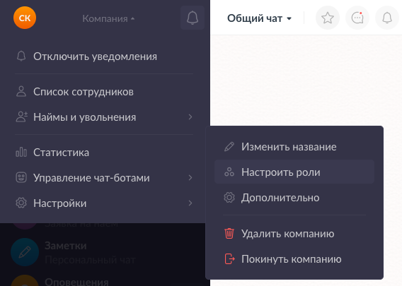 |
| --- |

| 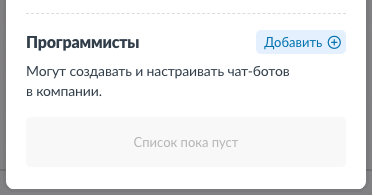 |
| --- |

После добавления роли пользователю у него в меню компании появится новый функционал для управления ботами:

| 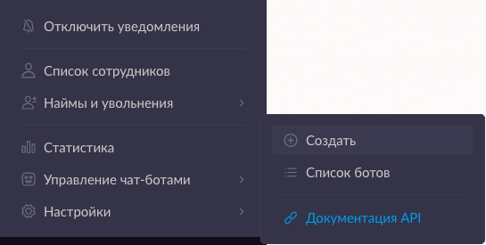 |
| --- |

| 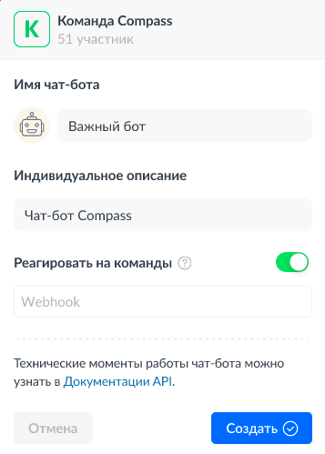 |
| --- |

При создании бота вы можете установить:

- имя новому боту;
- описание, для чего служит бот;
- webhook, куда будут перенаправлены команды от пользователей.<br>

Webhook — это URL-адрес вашего сервиса. После его установки бот может реагировать на созданные Программистом сообщения-команды, перенаправляя их на указанный вами адрес.

| 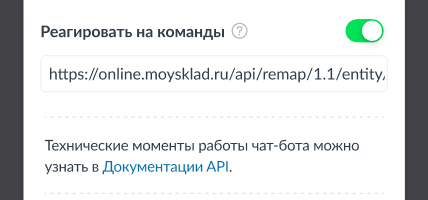 |
| --- |

#### Учётные данные бота
После создания бота в локации "Карточка бота" вам будут предоставлены **Токен** и **Ключ подписи** нового бота (видны только Программисту вашей компании).

**Токен бота (token)** — уникальный для каждого бота идентификатор.

| 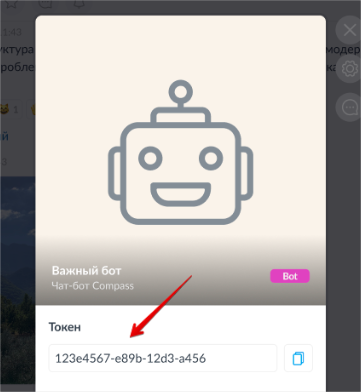 |
| --- |

**Ключ подписи** — ключ для генерации подписи (signature), которой подписывается каждый отправляемый запрос. Необходим для подтверждения, что запрос отправлен от вашего бота.

|  |
| --- |

⚠️ Обратите внимание: **не сообщайте Токен и Ключ подписи** вашего бота третьим лицам.<br>
В случае если это произошло, рекомендуется воспользоваться сменой ключа подписи в приложении Compass через настройки бота:

| 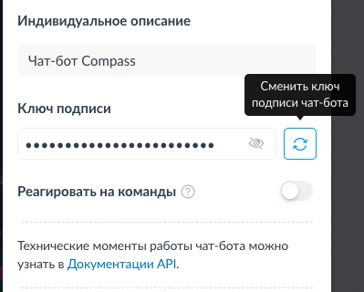 |
| --- |

Таким образом, все запросы бота, которые использовали скомпрометированный ключ подписи, станут недействительными для приложения Compass.

## Отправка запроса в Compass ##

Запросы к Compass Userbot API должны осуществляться через HTTPS-запрос методом POST, отправленный на endpoint: <br>
`https://userbot.getcompass.com/api/v2/` + (выполняемый метод)<br>

Все запросы должны использовать тип содержимого: **application/json**.<br>
Для загрузки файлов: **multipart/form-data**.

Тело каждого запроса к Compass должно содержать:
- **json-строку** требуемых параметров для запроса (пустой, если данные не требуются).

Авторизация запроса осуществляется через **header**-заголовки с использованием токена вашего бота и сгенерированной подписи:<br>
- заголовок "**Authorization: bearer={токен бота}**" - заголовок содержит токен, который принадлежит вашему боту (бот должен быть включён для этого);
- заголовок "**Signature: signature={сгенерированная подпись}**" - в заголовке передаётся подпись для валидации данных запроса (подробнее в разделе [Схема получения подписи для запроса](#Схема-получения-подписи-для-запроса)).

Все методы регистрозависимы и должны быть в кодировке UTF-8.

--- 

Рассмотрим запрос на примере отправки сообщения пользователю.

Используется метод [/user/send](#post-usersend).<br>
URL для отправляемого запроса: `https://userbot.getcompass.com/api/v2/user/send` <br>

Пример параметров для запроса:
```json5
{
    "text": "Hello, this is bot", // произвольный текст для нового сообщения от бота
    "type": "text",               // указываем, что сообщение является текстовым
    "user_id": 12345              // идентификатор пользователя, которому отправляется сообщение
}
```

Структура curl-запроса:<br>
<pre style="white-space:pre-wrap;">
curl -X POST -d "<b>{параметры в json-формате}</b>"
-H "Content-Type: application/json"
-H "Authorization: bearer=<b>{токен бота}</b>" 
-H "Signature: signature=<b>{сгенерированная подпись}</b>" 
https://userbot.getcompass.com/api/v2/user/send
</pre>


---

Бот может отправить сообщение в группу, участником которой является, конкретному
пользователю, а также в тред к сообщению.

При отправке запроса вам необходимо указать, куда будет отправлено сообщение от бота:

- если необходимо отправить пользователю, требуется ID пользователя, для которого предназначено сообщение;
- если необходимо отправить сообщение в группу, нужен уникальный ключ этой группы;
- если необходимо отправить сообщение в тред, нужен ключ сообщения, для которого будет создан тред.

#### ID пользователя

Идентификатор пользователя (параметр "user_id" в запросах) используется при отправке сообщения конкретному пользователю. Его можно получить в приложении Compass через локацию "Карточка
сотрудника" (доступно только Программисту вашей компании):

| 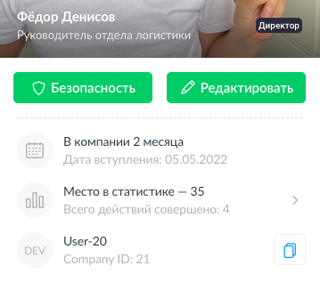 |
| --- |

#### Ключ диалога

Уникальный идентификатор группы (используется как "group_id" в запросах), участником которой является бот.<br>
Доступен для Программиста из локации "Меню чат-бота" в групповом диалоге:

| 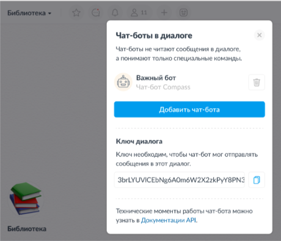 |
| --- |

Пример ключа диалога:

> 3brLYUVlCEbNg6A0m6W2X2zkPyY8PN3Ijw6efI20gVJHGiy4xHOociXAmMh1o/i01gLTS8wHHx7JGrrzIL4zDC6a4qX031dzJfqTzl8MD6Rqv2wd38yfGLS6n6VlwmPQ2hNNXCDPEL9sddmYCfHSSY/BfjXsNvJh3YpBH1pRf1I=

#### Ключ сообщения

Идентификатор сообщения (используется как "message_id" в запросах), с которым работает бот. Пример ключа сообщения:
> oDT9FLRWjDOX0+4smgkCn039jKIce+NUE90zy9neDKvh6ubLMDGU/Cee5e07avTPFT/WcnAJIXFxBYmT8vqbF5vNIi4T/YEKZh4yF4iLXo9J4pW/4UguVkB0XY9/vF5pzUHUL4eVr3ScGWEP3fUEWdNlws+pffgp9oUOl+X0HrFxXxuFVfREy6od/psN+lob

---

#### Схема получения подписи для запроса ####

Для получения подписи необходимо выполнить следующие действия:

- для примера возьмём запрос отправки сообщения от бота конкретному пользователю (метод [/user/send](#post-usersend));
- указываем параметры и значения для тела запроса:
>```json5  
>{
>    "user_id": 12345,
>    "text": "Hello, this is bot",
>    "type": "text"
>}
>```
- преобразуем передаваемые данные в формат json;
- получаем json-строку вида: `{"user_id":12345,"text":"Hello, this is bot","type":"text"}`;
- объединяем строки токена бота и полученную json-строку: `<токен бота> + <полученная json-строка>`
- после чего применяем функцию для генерации hash-строки на основе ключа шифрования, используя метод хэширования HMAC и алгоритм шифрования SHA256.<br>
>**hash_hmac("sha256", <токен бота> + <полученная json-строка>, <ключ подписи вашего бота>)**
>- hash_hmac — функция для генерации хэш-строки на основе ключа подписи вашего бота;
>- sha256 — используемый алгоритм шифрования;

Полученная строка является подписью, которая передаётся в header-заголовке запроса:<br>
**Signature: signature={сгенерированная подпись}**:

⚠️ Обратите внимание на следующий момент:
- полученная подпись (signature) **актуальна только** для текущих токена, ключа подписи и параметров запроса. Если один из них поменяется, то необходимо
   будет сгенерировать подпись заново по той же схеме.

---

#### Ответ от Compass после отправки запроса ####

Ответ представляет собой json-объект, в котором содержатся поля:
- **status** (string) — отражает статус выполнения запроса.<br>
  Может принимать значение "ok" (в случае, если запрос выполнился успешно) или "error" (в случае ошибки);
- **response** (json) — json-объект произвольных данных.

В случае успешного выполнения поле response может иметь данные выполненного запроса, либо пустое значение.

**Пример ответа с возвращаемыми данными:**
```json5 
{
    "status": "ok",
    "response": {
        "request_id": "fb32d289-2ec2-46b7-8116-ad3c4adeaa61"
    }
}
```

**Пример пустого ответа:**
```json5 
{
    "status": "ok",
    "response": {}
}
```

Если произошла ошибка, поле **status** будет принимать значение "error".<br>
В таком случае поле **response** будет содержать поля:
- **error_code** (int) — код ошибки. Более подробно расписано в разделе [Ошибки при выполнении запроса Compass Userbot API](#Ошибки-при-выполнении-запроса-Compass-Userbot-API);
- **message** (string) — произвольный текст ошибки.

**Пример ответа с ошибкой:**
```json5 
{
    "status": "error",
    "response": {
        "error_code": 1000,
        "message": "invalid parameters: not passed param text for request"
    }
}
```

#### Получение результата отправленного запроса ####

Все запросы к Compass, за исключением метода [/request/get](#post-requestget) и загрузки файла, выполняются асинхронно.<br>
Потому после выполнения запроса для получения результата необходимо запрашивать его по полученному идентификатору — `request_id`.
Это уникальный идентификатор выполняемого запроса в приложении Compass.

После успешной отправки запроса в Compass вы можете c интервалом 0.5c запрашивать результат выполнения с помощью метода [/request/get](#post-requestget).<br>

Рассмотрим схему получения результата на примере отправки сообщения от бота:
- выполним запрос [/user/send](#post-usersend), передав текст: Hello, this is bot :blush:
- ответ запроса будет содержать его `request_id`:
```json5 
{
    "status": "ok",
    "response": {
        "request_id": "fb32d289-2ec2-46b7-8116-ad3c4adeaa61"
    }
}
```
- в этот момент запрос взят на обработку, чтобы отправить сообщение пользователю от лица бота;
- вызов метода [/request/get](#post-requestget) с передачей `request_id` вернёт состояние указанного запроса:
> Если запрос ещё в процессе выполнения:
>
>```json5 
>{
>    "status": "error",
>    "response": {
>        "error_code": 7,
>        "message": "the request has not yet been completed, please try again in a while"
>    }
>}
>```
- такой ответ означает, что запрос ещё не выполнился — достаточно немного подождать (рекомендуем интервал не чаще чем 0.5с), после чего повторно запросить результат с помощью [/request/get](#post-requestget);
- в случае когда сообщение успешно отправлено, метод вернёт результат выполнения запроса — в данном примере это message_id отправленного ботом сообщения:
>```json5
>{
>     "status": "ok",
>     "response": {
>          "message_id": "eNb2VLAPCGFfK1gHzNkH78XNDsPr9N/dDI7f/yaeTof0zjXwv/G000SZFNwqBOx2ACjqSwFjB1Lhgtqn..."
>     }
>}
>```

| 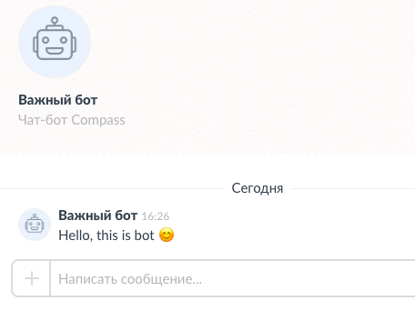 |
| --- |

## Webhook и реагирование на команды

Бот может реагировать на специальные команды-сообщения, добавленные Программистом с помощью метода [/command/update](#post-commandupdate):

| 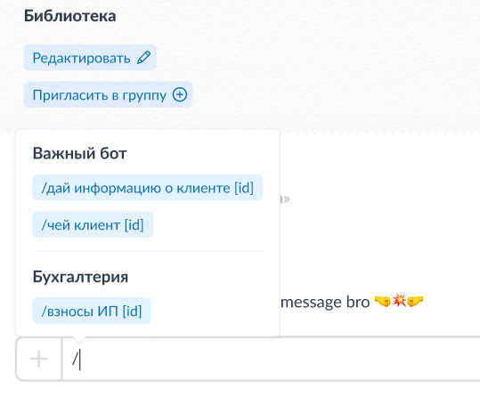 |
| --- |

Установленные команды будут видны каждому участнику компании на экране "Карточка бота":

|  |
| --- |

Когда пользователь отправляет сообщение-команду боту, у которого включён режим "Реагировать на команды" и установлен webhook, то на указанный адрес отправляются данные вида:

> Если команда была отправлена в групповом диалоге
>
>```json5 
>{
>    "group_id": "3brLYUVlCEbNg6A0m6W2X2zkPyY8PN3Ijw6efI20gVJHGiy4xHOociXAmMh1o/i01gLTS8wHHx7JGrrzIL4z...",
>    "message_id": "oDT9FLRWjDOX0+4smgkCn039jKIce+NUE90zy9neDKvh6ubLMDGU/Cee5e07avTPFT/WcnAJIXFxBYmT8vqbF5vNIi4T/YEKZh...",
>    "text": "/покажи список команд"
>    "type": "group",
>    "user_id": 12345,
>}
>```

- group_id — ключ группового диалога, откуда отправлена команда;
- message_id — уникальный идентификатор сообщения-команды;
- text — текст команды, переданной боту;
- type — указывает, откуда пришла команда (single — диалог с ботом; group — групповой диалог);
- user_id — идентификатор пользователя в приложении Compass, который отправил команду.

> Если команда была отправлена в личном диалоге с ботом
>
>```json5 
>{
>     "group_id": "",
>     "message_id": "oDT9FLRWjDOX0+4smgkCn039jKIce+NUE90zy9neDKvh6ubLMDGU/Cee5e07avTPFT/WcnAJIXFxBYmT8vqbF5vNIi4T/YEKZh...",
>     "text": "/покажи список команд"
>     "type": "single",
>     "user_id": 12345,
>}
>```

⚠️ Обратите внимание: на ваш сервис отправляются только те сообщения, текст которых совпадает с шаблоном команд, прописанных Программистом вашей компании. **Другие сообщения из диалога не отправляются на webhook**.

Запрос будет подписан header-заголовком с использованием токена того бота, которому принадлежит отправленная команда:<br>
>заголовок "**Authorization: bearer={токен бота}**".<br>

Также в запросе будет передан header-заголовок, содержащий сгенерированную подпись для отправляемых данных (созданная по стандартной [схеме получения подписи](#Схема-получения-подписи-для-запроса)):<br>
>заголовок "**Signature: signature={сгенерированная подпись}**".<br>

Получив данные на ваш webhook, вы можете:
- по токену проверить, что запрос пришёл для вашего бота;
- сгенерировать подпись, после чего сравнить с hash-строкой в заголовке "Signature". При совпадении строк вы тем самым можете убедиться, что данные отправлены из приложения Compass, а не третьими лицами.

#### Версия webhook бота

Каждый чат-бот Compass имеет версию для webhook, которая позволяет более гибко взаимодействовать с Userbot API при изменениях api.<br>

Рассмотрим пример:<br>
В новой версии Userbot API изменился формат данных, отправляемых на адрес вашего webhook, к примеру, появился новый тип диалога:
>type: "group/single/ **(new) channel**"

В таком случае бот, используемый вами до изменений, будет иметь версию webhook, которую новые изменения **не затронут**, и на адрес вашего webhook будут отправляться данные известного вам формата.<br>
После того как с вашей стороны будут учтены новые изменения, вы можете с помощью метода [/webhook/setVersion](#post-webhooksetversion) переключить версию webhook на актуальный.

## Список методов Compass Userbot API

| Метод | Для чего используется |
| :--- | :--- |
| [/request/get](#post-requestget) | получить результат выполнения запроса. |
| [/user/send](#post-usersend) | отправить сообщение от бота конкретному пользователю. |
| [/group/send](#post-groupsend) | отправить сообщение от бота в групповой диалог. |
| [/thread/send](#post-threadsend) | отправить сообщение от бота в тред. |
| [/message/addReaction](#post-messageaddreaction) | добавить реакцию на сообщение от лица бота. |
| [/message/removeReaction](#post-messageremovereaction) | удалить реакцию бота с сообщения. |
| [/user/getList](#post-usergetlist) | получить данные об участниках компании. |
| [/group/getList](#post-groupgetlist) | получить данные групп, в которых состоит бот. |
| [/command/update](#post-commandupdate) | обновить список команд бота. |
| [/command/getList](#post-commandgetlist) | получить список команд бота. |
| [/webhook/setVersion](#post-webhooksetversion) | установить версию для webhook бота. |
| [/webhook/getVersion](#post-webhookgetversion) | получить текущую версию webhook бота. |
| [/file/getUrl](#post-filegeturl) | получить URL для загрузки файлов. |

## Описание методов

### `POST /request/get`

Метод для получения результата отправленного запроса.<br>
URL для запроса: `https://userbot.getcompass.com/api/v2/request/get` <br>

В случае успешного выполнения вернётся результат выполнения запроса.<br>
В теле запроса должны быть указаны следующие параметры:

| Название | Тип | Свойство | Описание | 
| -------- | --- | --- | -------- |
| request_id | string | обязательный | идентификатор отправленного запроса в приложение Compass. |

<details><summary>Пример данных для тела запроса и результата выполнения</summary>
<br>

Данные для тела запроса:
```json5 
{"request_id": "2f991a80-750c-4abc-b7e1-1f16456de59d"}
```

Результат выполнения запроса (например, запросили информацию об участниках компании)
```json5 
{
     "status": "ok",
     "response": {
          "user_list": [
               {
                    "user_id": 1,
                    "user_name": "Иванов Иван",
                    "avatar_file_url": ""
               },
               {
                    "user_id": 2,
                    "user_name": "Михаилов Михаил",
                    "avatar_file_url": "https://file-1.getcompass.com/files/pivot/dca/e8d/632/fa7/51f/fdcaee3ecea91e6c_w400.jpeg"
               }
          ]
     }
}
```

</details>

Список возможных ошибок:

| error_code | Значение |
| --- | --- |
| 7 | запрос ещё не выполнен, повторите через некоторое время. |
| 1000 | переданы некорректные данные (например, параметр request_id, который отсутствует в базе). |

---

### `POST /user/send`

Метод для отправки сообщения от бота пользователю.<br>
URL для запроса: `https://userbot.getcompass.com/api/v2/user/send`

В теле запроса должны быть указаны следующие параметры:

| Название | Тип | Свойство | Описание |
| -------- | --- | --- | -------- |
| user_id | int | обязательный | id пользователя, которому бот отправит сообщение в личный диалог. |
| text | string | обязательный, если не передан параметр file_id | текст сообщения от бота. |
| file_id | string | обязательный, если не передан параметр text | идентификатор файла для сообщения-файла.<br> О получении file_id подробнее расписано в [данном разделе](#post-filegeturl). |
| type | string | обязательный | для текстовых сообщений необходимо передавать в этот параметр значение = "text".<br>для сообщений-файлов необходимо передавать в этот параметр значение = "file". |

В ответе метода вернётся `request_id` запроса, который выполняется асинхронно. Результат выполнения можно получить с помощью метода [/request/get](#post-requestget).<br>
Результатом данного метода будет:<br>
message_id (string) — ключ сообщения, отправленного ботом.

<details><summary>Пример данных для тела запроса и результата выполнения</summary>
<br>

Данные для тела запроса:
```json5 
{
     "text": "Привет, это сообщение от бота",
     "type": "text",
     "user_id": 12345
}
```

Результат выполнения запроса:
```json5 
{
     "status": "ok",
     "response": {
          "message_id": "eNb2VLAPCGFfK1gHzNkH78XNDsPr9N/dDI7f/yaeTof0zjXwv/G000SZFNwqBOx2ACjqSwFjB1Lhgtqn..."
     }
}
```

</details>

Список возможных ошибок:

| error_code | Значение |
| --- | --- |
| 7 | запрос ещё не выполнен, повторите через некоторое время. |
| 1000 | переданы некорректные данные (например, не передан один из параметров). |
| 1001 | выбранный пользователь не существует в компании. |
| 1002 | выбранный пользователь покинул компанию. |

---

### `POST /group/send`

Метод для отправки сообщения от бота в группу.<br>
URL для запроса: `https://userbot.getcompass.com/api/v2/group/send`

В теле запроса должны быть указаны следующие параметры:

| Название | Тип | Свойство | Описание |
| -------- | --- | --- | -------- |
| group_id | string | обязательный | идентификатор группы, в которое бот отправит сообщение. |
| text | string | обязательный, если не передан параметр file_id | текст сообщения от бота. |
| file_id | string | обязательный, если не передан параметр text | идентификатор файла для сообщения-файла.<br> О получении file_id подробнее расписано в [данном разделе](#post-filegeturl). |
| type | string | обязательный | для текстовых сообщений необходимо передавать в этот параметр значение = "text".<br>для сообщений-файлов необходимо передавать в этот параметр значение = "file". |

В ответе метода вернётся `request_id` запроса, который выполняется асинхронно. Результат выполнения можно получить с помощью метода [/request/get](#post-requestget).<br>
Результатом данного метода будет:<br>
message_id (string) — ключ сообщения, отправленного ботом в группу.

<details><summary>Пример данных для тела запроса и результата выполнения</summary>
<br>

Данные для тела запроса:
```json5 
{
     "group_id": "GrrzIL4zDC6a4qX031dzJfqTzl8MD6Rqv2wd38yfGLS6n3brLYUVlCEbNg6A0m6W2X2zkPyY8PN3Ijw6e...",
     "text": "Привет, это сообщение от бота для группы",
     "type": "text"
}
```

Результат выполнения запроса:
```json5 
{
     "status": "ok",
     "response": {
          "message_id": "eNb2VLAPCGFfK1gHzNkH78XNDsPr9N/dDI7f/yaeTof0zjXwv/G000SZFNwqBOx2ACjqSwFjB1LhgtqnmXFReGjz..."
     }
}
```

</details>

Список возможных ошибок:

| error_code | Значение |
| --- | --- |
| 7 | запрос ещё не выполнен, повторите через некоторое время. |
| 1000 | переданы некорректные данные (например, не передан один из параметров). |
| 1003 | бот не состоит в групповом диалоге. |
| 1004 | такой групповой диалог не существует. |

---

### `POST /thread/send`

Метод для отправки сообщения от бота в тред.<br>
URL для запроса: `https://userbot.getcompass.com/api/v2/thread/send`

В теле запроса должны быть указаны следующие параметры:

| Название | Тип | Свойство | Описание |
| -------- | --- | --- | -------- |
| message_id | string | обязательный | идентификатор сообщения-команды, для которого будет создан тред, если ранее он не был создан, и отправлено сообщение от бота в этот тред. |
| text | string | обязательный, если не передан параметр file_id | текст сообщения от бота. |
| file_id | string | обязательный, если не передан параметр text | идентификатор файла для сообщения-файла.<br> О получении file_id подробнее расписано в [данном разделе](#post-filegeturl). |
| type | string | обязательный | для текстовых сообщений необходимо передавать в этот параметр значение = "text".<br>для сообщений-файлов необходимо передавать в этот параметр значение = "file". |

В ответе метода вернётся `request_id` запроса, который выполняется асинхронно. Результат выполнения можно получить с помощью метода [/request/get](#post-requestget).<br>
Результатом данного метода будет:<br>
message_id (string) — ключ сообщения, отправленного ботом в тред.

<details><summary>Пример данных для тела запроса и результата выполнения</summary>
<br>

Данные для тела запроса:
```json5 
{
     "message_id": "oDT9FLRWjDOX0+4smgkCn039jKIce+NUE90zy9neDKvh6ubLMDGU/Cee5e07avTPFT/WcnAJIXFx...",
     "text": "Привет, это сообщение от бота в тред",
     "type": "text"
}
```

Результат выполнения запроса:
```json5 
{
     "status": "ok",
     "response": {
          "message_id": "eNb2VLAPCGFfK1gHzNkH78XNDsPr9N/dDI7f/yaeTof0zjXwv/G000SZFNwqBOx2ACjqSwFj..."
     }
}
```

</details>

Список возможных ошибок:

| error_code | Значение |
| --- | --- |
| 7 | запрос ещё не выполнен, повторите через некоторое время. |
| 1000 | переданы некорректные данные (например, не передан один из параметров). |
| 1005 | у бота отсутствует доступ к сообщению (сообщение удалено или диалог очищен). |
| 1007 | переданный id сообщения не существует. |

---

### `POST /message/addReaction`

Метод для добавления реакции на сообщение от лица бота.<br>
URL для запроса: `https://userbot.getcompass.com/api/v2/message/addReaction`

Приложение Compass поддерживает список реакций версии 14.0: https://emojipedia.org/emoji-14.0/. <br>

В теле запроса должны быть указаны следующие параметры:

| Название | Тип | Свойство | Описание |
| -------- | --- | --- | -------- |
| message_id | string | обязательный | идентификатор сообщения, на которое устанавливается реакция от лица бота. |
| reaction | string | обязательный | реакция, которую необходимо установить.<br>Может принимать значение:<br>- короткое описание (short_name). Например, `:blush:`<br>- emoji. Например, 😊 |

В ответе метода вернётся `request_id` запроса, который выполняется асинхронно. Результат выполнения можно получить с помощью метода [/request/get](#post-requestget).<br>
Результатом данного метода будет стандартный ответ "ok" без возвращаемых данных.

<details><summary>Пример данных для тела запроса и результата выполнения</summary>
<br>

Данные для тела запроса:
```json5 
{
     "message_id": "oDT9FLRWjDOX0+4smgkCn039jKIce+NUE90zy9neDKvh6ubLMDGU/Cee5e07avTPFT/WcnAJIXFxBYmT8v...",
     "reaction": ":blush:"
}
```

Результат выполнения запроса:
```json5 
{
     "status": "ok",
     "response": {}
}
```

</details>

Список возможных ошибок:

| error_code | Значение |
| --- | --- |
| 7 | запрос ещё не выполнен, повторите через некоторое время. |
| 1000 | переданы некорректные данные (например, не передан один из параметров). |
| 1005 | у бота отсутствует доступ к сообщению (сообщение удалено или диалог очищен). |
| 1006 | переданная реакция отсутствует в приложении. |
| 1007 | переданный id сообщения не существует. |

---

### `POST /message/removeReaction`

Метод для удаления реакции бота с сообщения.<br>
URL для запроса: `https://userbot.getcompass.com/api/v2/message/removeReaction`

Приложение Compass поддерживает список реакций версии 14.0: https://emojipedia.org/emoji-14.0/. <br>

В теле запроса должны быть указаны следующие параметры:

| Название | Тип | Свойство | Описание |
| -------- | --- | --- | -------- |
| message_id | string | обязательный | идентификатор сообщения, с которого будет удалена реакция бота. |
| reaction | string | обязательный | реакция, которую необходимо удалить.<br>Может принимать значение:<br>- короткое описание (short_name). Например, `:blush:`<br>- emoji. Например, 😊 |

В ответе метода вернётся `request_id` запроса, который выполняется асинхронно. Результат выполнения можно получить с помощью метода [/request/get](#post-requestget).<br>
Результатом данного метода будет стандартный ответ "ok" без возвращаемых данных.

<details><summary>Пример данных для тела запроса и результата выполнения</summary>
<br>

Данные для тела запроса:
```json5 
{
     "message_id": "oDT9FLRWjDOX0+4smgkCn039jKIce+NUE90zy9neDKvh6ubLMDGU/Cee5e07avTPFT/WcnAJIXFxBYmT8v...",
     "reaction": ":blush:"
}
```

Результат выполнения запроса:
```json5 
{
     "status": "ok",
     "response": {}
}
```

</details>

Список возможных ошибок:

| error_code | Значение |
| --- | --- |
| 7 | запрос ещё не выполнен, повторите через некоторое время. |
| 1000 | переданы некорректные данные (например, не передан один из параметров). |
| 1005 | у бота отсутствует доступ к сообщению (сообщение удалено или диалог очищен). |
| 1006 | переданная реакция отсутствует в приложении. |
| 1007 | переданный id сообщения не существует. |

---

### `POST /user/getList`

Метод для получения данных об участниках компании.<br>
URL для запроса: `https://userbot.getcompass.com/api/v2/user/getList`

В теле запроса могут использоваться следующие параметры:

| Название | Тип | Свойство | Описание |
| -------- | --- | --- | -------- |
| count | int | _необязательный_ | количество данных в ответе. По умолчанию = 100.<br>Максимум = 300. |
| offset | int | _необязательный_ | смещение для пагинации данных. По умолчанию = 0. |

В ответе метода вернётся `request_id` запроса, который выполняется асинхронно. Результат выполнения можно получить с помощью метода [/request/get](#post-requestget).<br>
Результатом данного метода будет:<br>
user_list (array) — список с информацией по участникам компании.

<details><summary>Пример данных для тела запроса и результата выполнения</summary>
<br>

Данные для тела запроса:
```json5 
{"count": 300, "offset": 0}
```

Результат выполнения запроса:
```json5 
{
     "status": "ok",
     "response": {
          "user_list": [
               {
                    "user_id": 1,
                    "user_name": "Иванов Иван",
                    "avatar_file_url": ""
               },
               {
                    "user_id": 2,
                    "user_name": "Михаилов Михаил",
                    "avatar_file_url": "https://file-1.getcompass.com/files/pivot/dca/e8d/632/fa7/51f/fdcaee3ecea91e6c_w400.jpeg"
               }
          ]
     }
}
```

</details>

Список возможных ошибок:

| error_code | Значение |
| --- | --- |
| 7 | запрос ещё не выполнен, повторите через некоторое время. |

---

### `POST /group/getList`

Метод для получения информации о группах, в которых состоит бот.<br>
URL для запроса: `https://userbot.getcompass.com/api/v2/group/getList`

В теле запроса могут использоваться следующие параметры:

| Название | Тип | Свойство | Описание |
| -------- | --- | --- | -------- |
| count | int | _необязательный_ | количество данных в ответе. По умолчанию = 100.<br>Максимум = 300. |
| offset | int | _необязательный_ | смещение для пагинации данных. По умолчанию = 0. |

В ответе метода вернётся `request_id` запроса, который выполняется асинхронно. Результат выполнения можно получить с помощью метода [/request/get](#post-requestget).<br>
Результатом данного метода будет:<br>
group_list (array) — список с информацией по групповым диалогам бота.

<details><summary>Пример данных для тела запроса и результата выполнения</summary>
<br>

Данные для тела запроса:
```json5 
{"count": 50, "offset": 0}
```

Результат выполнения запроса:
```json5 
{
     "status": "ok",
     "response": {
          "group_list": [
               {
                    "group_id": "kPyY8PN3Ijw6efI20gVJHGiy4xHOociXAmMh1o/i01gLTS8wHHx7JGrrzIL4zDC6a4qX031dzJfqTzl8MD6Rqv2wd38...",
                    "name": "Библиотека",
                    "avatar_file_url": "https://file-1.getcompass.com/files/c1/cba/30i/de0/2ff/uf3/4128e05b1cbd1f79_w80.jpg"
               },
               {
                    "group_id": "GrrzIL4zDC6a4qX031dzJfqTzl8MD6Rqv2wd38yfGLS6n3brLYUVlCEbNg6A0m6W2X2zkPyY8PN3Ijw6efI20gVJHG...",
                    "name": "Расписание",
                    "avatar_file_url": "https://file-1.getcompass.com/files/c1/cde/b4s/duo/1fc/97t/4128e05b1cbd1f79_w80.jpg"
               },
               {
                    "group_id": "3brLYUVlCEbNg6A0m6W2X2zkPyY8OociXAmMh1o/i01gLTS8wHHx7JGrrzIL4zDC6a4qX031dzJfqTzl8MD6Rqv2wd...",
                    "name": "Статистика",
                    "avatar_file_url": "https://file-1.getcompass.com/files/c1/adf/a1e/pra/4ca/mt5/4128e05b1cbd1f79_w80.jpg"
               }
          ]
     }
}
```

</details>

Список возможных ошибок:

| error_code | Значение |
| --- | --- |
| 7 | запрос ещё не выполнен, повторите через некоторое время. |

---

### `POST /command/update`

Метод для обновления списка команд бота.<br>
URL для запроса: `https://userbot.getcompass.com/api/v2/command/update`

В теле запроса должны быть указаны следующие параметры:

| Название | Тип | Свойство | Описание |
| -------- | --- | --- | -------- |
| command_list | array | обязательный | новый список строк-команд для бота (максимум 30 команд для бота). |

Несколько правил для установки команд:

- длина команды не должна превышать 80 символов;
- команда может иметь параметры, заключенные в квадратные скобки. В этом случае паттерн для определения команд для бота "проигнорирует" их при
  обработке, посчитав за переданный параметр.<br>
  Например, бот в списке команд имеет команду: "отправить сообщение пользователю [ID]". В случае отправки в чат сообщения "/отправить сообщение
  пользователю [1666]" парсер определит её как команду.
- команды могут состоять из букв русского и латинского алфавита, цифр и знака подчёркивания. Несколько примеров:
> /помощь
>
> /чей клиент [ID]
>
> /установить_таймер 10мин

В ответе метода вернётся `request_id` запроса, который выполняется асинхронно. Результат выполнения можно получить с помощью метода [/request/get](#post-requestget).<br>
Результатом данного метода будет стандартный ответ "ok" без возвращаемых данных.

<details><summary>Пример данных для тела запроса и результата выполнения</summary>
<br>

Данные для тела запроса:
```json5 
{
     "command_list": [
          "/помощь",
          "/отправить сообщение пользователю [ID]"
     ]
}
```

Результат выполнения запроса:
```json5 
{
     "status": "ok",
     "response": {}
}
```

</details>

Список возможных ошибок:

| error_code | Значение |
| --- | --- |
| 7 | запрос ещё не выполнен, повторите через некоторое время. |
| 1000 | переданы некорректные данные (превышена длина для команды). |
| 1008 | превышен лимит списка команд. |
| 1009 | некорректная команда в списке. |

---

### `POST /command/getList`

Метод для получения списка команд бота.<br>
URL для запроса: `https://userbot.getcompass.com/api/v2/command/getList`

В теле запроса **не требуются** передавать параметры.

В ответе метода вернётся `request_id` запроса, который выполняется асинхронно. Результат выполнения можно получить с помощью метода [/request/get](#post-requestget).<br>
Результатом данного метода будет:<br>
command_list (array) — список команд бота.

<details><summary>Пример результата выполнения запроса</summary>

```json5 
{
     "status": "ok",
     "response": {
          "command_list": [
               "/помощь",
               "/отправить сообщение пользователю [ID]"
          ]
     }
}
```

</details>

Список возможных ошибок:

| error_code | Значение |
| --- | --- |
| 7 | запрос ещё не выполнен, повторите через некоторое время. |

---

### `POST /webhook/setVersion`

Метод для установки уровня версии webhook бота.<br>
URL для запроса: `https://userbot.getcompass.com/api/v2/webhook/setVersion`

В теле запроса должны быть указаны следующие параметры:

| Название | Тип | Свойство | Описание |
| -------- | --- | --- | -------- |
| version | int | обязательный | номер версии для webhook бота. |

В ответе метода вернётся `request_id` запроса, который выполняется асинхронно. Результат выполнения можно получить с помощью метода [/request/get](#post-requestget).<br>
Результатом данного метода будет стандартный ответ "ok" без возвращаемых данных.

<details><summary>Пример данных для тела запроса и результата выполнения</summary>
<br>

Данные для тела запроса:
```json5 
{"version": 2}
```

Результат выполнения запроса:
```json5 
{
     "status": "ok",
     "response": {}
}
```

</details>

Список возможных ошибок:

| error_code | Значение |
| --- | --- |
| 7 | запрос ещё не выполнен, повторите через некоторое время. |
| 1000 | переданы некорректные данные. |
| 1011 | передана некорректная версия webhook. |

---

### `POST /webhook/getVersion`

Метод для получения уровня версии webhook бота.<br>
URL для запроса: `https://userbot.getcompass.com/api/v2/webhook/getVersion`

В теле запроса **не требуются** передавать параметры.

Результатом данного метода будет:<br>
version (int) — уровень версии webhook бота.

<details><summary>Пример результата выполнения запроса</summary>

```json5 
{
     "status": "ok",
     "response": {
          "version": 2
     }
}
```

</details>

---

### `POST /file/getUrl`

Метод для получения URL ноды, куда загружаются файлы.

Предназначен для дальнейшего получения параметра file_id для отправки сообщения-файла.<br>
URL для запроса: `https://userbot.getcompass.com/api/v2/file/getUrl`

В теле запроса **не требуются** передавать параметры.

В ответе метода вернётся `request_id` запроса, который выполняется асинхронно. Результат выполнения можно получить с помощью метода [/request/get](#post-requestget).<br>
Результатом данного метода будет:<br>
node_url — URL-адрес сервера, на который возможно загрузить файл;<br>
file_token — токен для валидации запроса загрузки файла.

<details><summary>Пример результата выполнения запроса</summary>

```json5 
{
     "status": "ok",
     "response": {
          "node_url": "https://file1.getcompass.com/api/userbot/files/upload",
          "file_token": "404952d4ac90ae960de4d2a96fb95d306493e151"
     }
}
```

</details>

---

После получения URL сервера, появится возможность загрузить файл составным запросом с помощью [multipart/form-data](https://ru.wikipedia.org/wiki/Multipart/form-data), подписав запрос полученным file-токеном.

В нашем случае с полученными из ответа node_url и токеном для загрузки файла запрос будет выглядеть следующим образом:<br>
URL для запроса: `https://file1.getcompass.com/api/userbot/files/upload`

| Название | Тип | Свойство | Описание |
| -------- | --- | --- | -------- |
| token | string | обязательный | токен для валидации загрузки файла. |
| file | string/binary | обязательный | содержимое файла для загрузки. |

⚠️ Ограничения для загрузки файла:

- максимальный размер файла — 256Mb;
- один токен разрешает загрузку одного файла — второй файл с помощью него не загрузить;
- для загрузки доступно не больше 50 файлов за 5 минут.

После успешной загрузки файла (синхронное выполнение — файл будет загружен сразу) в ответе от метода вернётся:<br>
file_id (string) — уникальный идентификатор загруженного файла.

<details><summary>Пример запроса и результата выполнения запроса</summary>

Пример запроса:
```json5 
token: "404952d4ac90ae960de4d2a96fb95d306493e151", // значение полученного file_token
file: "(binary)"                                   // бинарные данные загружаемого файла
```

Результат выполнения запроса:
```json5 
{
     "status": "ok",
     "response": {
          "file_id": "+OVV/dHD03Pb/qRQz9W/FhgupqO6UY0lmbwnG5tz9mHW51N8gA10VvotOzq01GuWq/c5LGZSldSCz4aki..."
     }
}
```

</details>

Список возможных ошибок:

| error_code | Значение |
| --- | --- |
| 7 | запрос ещё не выполнен, повторите через некоторое время. |
| 1000 | переданы некорректные данные. |
| 1010 | не удалось загрузить файл. |

---

### Дополнительное форматирование сообщений

Боту доступен функционал, позволяющий упомянуть пользователя в отправленном сообщении:

| 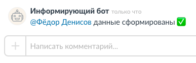 |
| --- |

Для этого текст сообщения должен иметь формат вида:<br>
`["@"|<числовой идентификатор user_id>|"<имя пользователя>"]`

На примере выше представим, что у Фёдора Денисова ID пользователя соответствует 345. Для получения сообщения, как в примере, текст отправленного от бота сообщения должен иметь вид:<br>
`["@"|345|Фёдор Денисов] данные сформированы ✅`

---

Также бот обладает теми же способностями форматирования сообщений, что и пользователь Compass.<br>
Например, менять стиль шрифта или выделить слова определённым цветом:
- для создания жирного шрифта текста: \*жирный шрифт\*
- для создания курсива в тексте: \_курсив\_
- для создания зачёркнутого текста: \~зачёркнутый текст\~
- текст на чёрном фоне: \``текст на чёрном фоне\``
- текст, выделенный зелёным: \++зелёное выделение\++
- текст, выделенный красным: \--красное выделение\--

| 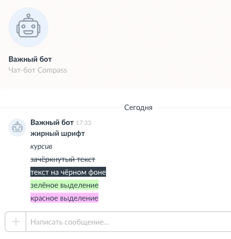 |
| --- |


## Ошибки при выполнении запроса Compass Userbot API

В случае если при выполнении запроса произошла ошибка, то возвращается ответ следующего формата:

```json5 
{
     "status": "error",
     "response": {
          "error_code": 1,
          "message": "missing required fields for request"
     }
}
```
- status "error" — сообщает о том, что запрос завершился ошибкой;
- error_code — специальный код ошибки;
- message — произвольный текст для описания ошибки.

---

Список **системных ошибок** при попытке выполнить запрос. Возвращаются, когда переданы некорректные данные запроса и в случае, если запрос ещё не выполнен.

| error_code | Описание |
| --- | --- |
| 1 | отсутствуют обязательные поля для запроса. |
| 2 | токен запроса не найден. |
| 3 | бот выключен или удалён — выполнение запроса невозможно. |
| 4 | некорректная подпись для валидации переданных данных. |
| 5 | набран лимит ошибок при выполнении запроса. |
| 6 | неизвестная ошибка при выполнении внутреннего метода для запроса. |
| 7 | запрос ещё не выполнен, повторите через некоторое время. |
| 8 | указаны некорректные параметры для запроса. |
| 9 | указан некорректный метод запроса. |

---

Список **ошибок при выполнении** запроса. Такие ошибки можно получить при провальной попытке выполнить запрос в приложении Compass.<br>
Например, при попытке от лица бота написать уволенному сотруднику.

| error_code | Значение |
| --- | --- |
| 1000 | переданы некорректные данные. |
| 1001 | выбранный пользователь не существует в компании. |
| 1002 | выбранный пользователь покинул компанию. |
| 1003 | бот не состоит в групповом диалоге. |
| 1004 | такой групповой диалог не существует. |
| 1005 | у бота отсутствует доступ к сообщению (сообщение удалено или диалог очищен). |
| 1006 | переданная реакция отсутствует в приложении. |
| 1007 | переданный id сообщения не существует. |
| 1008 | превышен лимит списка команд. |
| 1009 | некорректная команда в списке. |
| 1010 | не удалось загрузить файл. |
| 1011 | передана некорректная версия webhook. |

## Библиотека для работы с API чат-ботов приложения Compass

Для вашего удобства нами была создана библиотека для взаимодействия с Compass Userbot API:<br>
[Библиотека для работы с API чат-ботов](https://github.com/getCompass/php_lib_userbot). <br>
