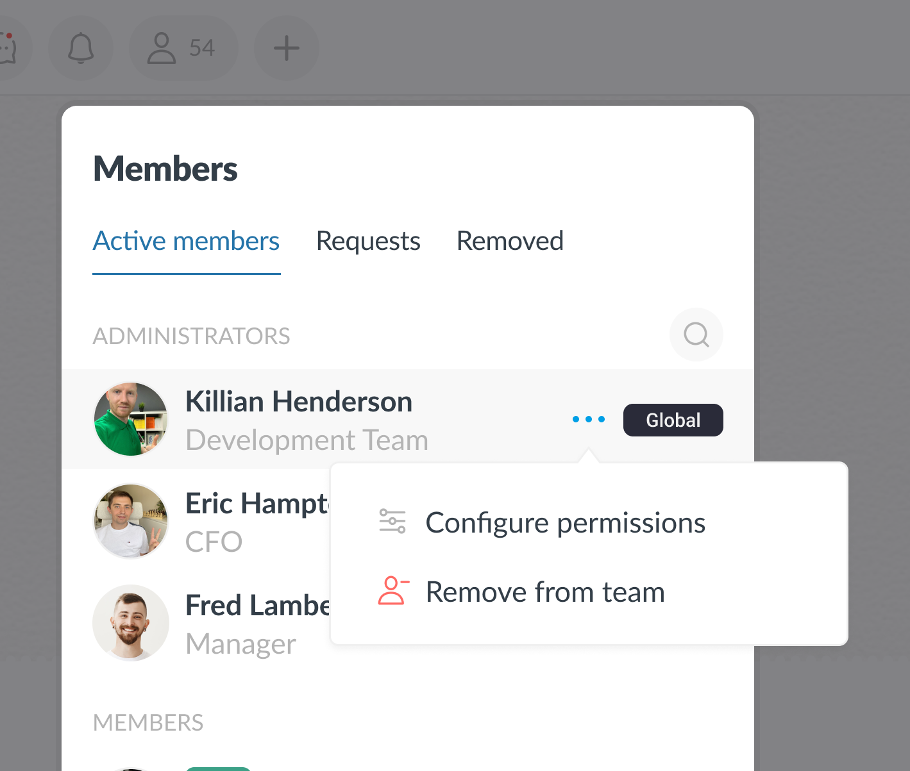
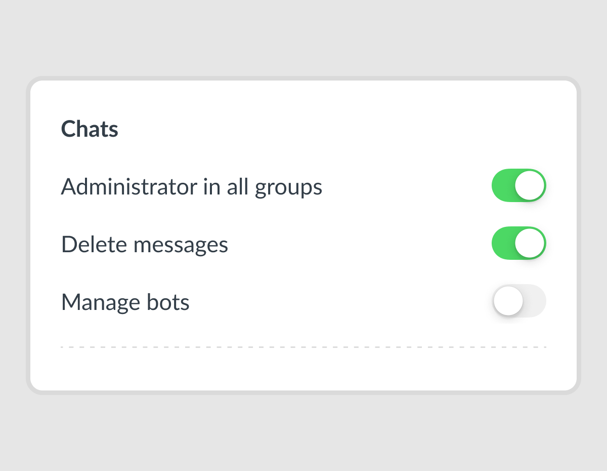
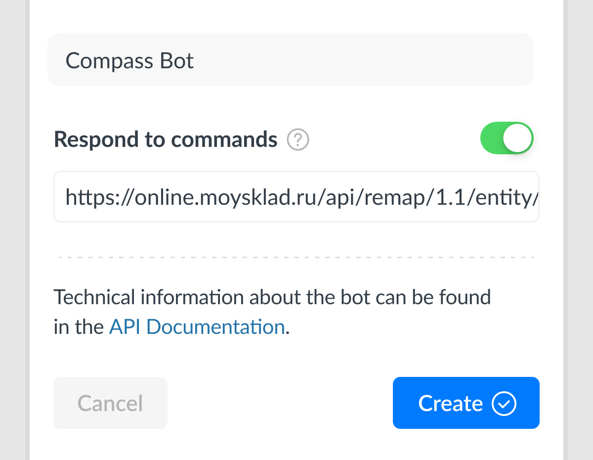
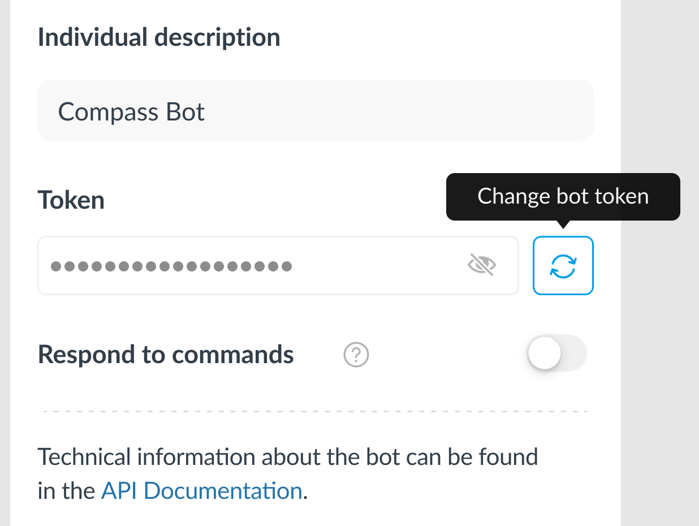
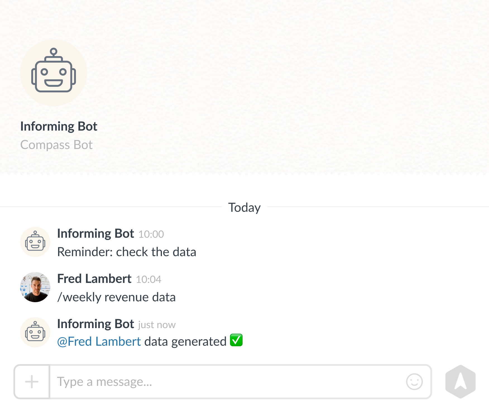

[](https://github.com/getCompass/userbot/blob/master/README.md)
[](https://github.com/getCompass/userbot/blob/master/README_ru.md)

- [Bot](#Bot)
- [Creating a bot](#Creating-a-bot)
  - [Bot credentials](#Bot-credentials)
- [Sending a request to Compass](#Sending-a-request-to-Compass)
  - [Response from Compass after sending a request](#Response-from-Compass-after-sending-a-request)
- [Webhook and responding to commands](#Webhook-and-responding-to-commands)
  - [Response to the user's command](#Response-to-the-users-command)
  - [Actions available for responding with a webhook](#Actions-available-for-responding-with-a-webhook)
  - [Bot Webhook version](#Bot-Webhook-version)
- [Compass Userbot API method list](#Compass-Userbot-API-method-list)
- [Additional message formatting](#Additional-message-formatting)
- [Errors in executing the Compass Userbot API request](#Errors-when-executing-the-Compass-Userbot-API-request)
- [Library for Compass Userbot API](#Library-for-working-with-the-Compass-Userbot-API)
## Bot ##

A bot is a special account in the Compass app created by the user to automatically perform customized actions.

What the Compass bot can do:
- send messages to private and group chats
- add reactions to messages
- send files to a chat
- collect basic information on team members (user_id, name, URL of the profile picture)

The actions listed above are implemented through special requests described in [Compass Userbot API method list](#Compass-Userbot-API-method-list).

Also, if you enable "Respond to commands" mode, the bot will start responding to commands that you specify and redirect them to your webhook address (more details about it below in [Webhook and responding to commands](#Webhook-and-responding-to-commands)).

## Creating a bot ##

Users with permission to manage bots can create bots.

This permission can be granted to members in the respective settings. To do it, go to "Members", select the user to whom you want to grant permission, and then select "Configure permissions".

|  |
|-----------------------------------------|

|   |
|-----------------------------------------|

After permissions are set, the sidebar will be updated and managing bot option will become available:

|   |
|------------------------------------------|

|   |
|------------------------------------------|

When creating a bot you may set the following parameters:
- bot name
- bot purpose
- webhook, where member commands will be redirected

Webhook is your service's URL. After setting it up, the bot is enabled to respond to the commands by redirecting them to the address you specified.

|   |
|-------------------------------------------|

#### Bot credentials
After creating a bot, you will be given a new bot **token** (visible to members with bot management permission) in the "Bot Card" section.

**The bot token** is a unique identifier for each bot.

|  |
|------------------------------------------|

⚠️ Please note: **Your bot's token** must not be given to third parties.

If you have already done it, it's better if you change the token through bot settings in Compass:

|  |
|------------------------------------------|

Thus, all bot requests that used the compromised token will become invalid for the Compass app.

## Sending a request to Compass ##

Requests to Compass Userbot API must be performed via HTTPS-request using POST method sent to endpoint: <br>
URL for Cloud version of the product: <br>
`https://userbot.getcompass.com/api/v3/` + (implemented method)<br>

URL for On-premise version of the product: <br>
`https://<yourdomain>/userbot/api/v3/` + (implemented method)<br>

All requests must be set with content type **application/json**.<br>
To upload files **multipart/form-data**.

The body of each request to Compass must contain the following:
- **json string** of required parameters for the request (empty if no data is required)

Request authorization is done via **headers** using your bot's token:<br>
- header "**Authorization: bearer={bot token}**" - the header contains a token that belongs to your bot (the bot must be enabled for this)

All methods are case sensitive and must be UTF-8 encoded.

--- 

Let's look at a request using the example of sending a message to a member.

[/user/send](#post-usersend) method is used.<br>
URL for the request: `https://userbot.getcompass.com/api/v3/user/send` <br>

Example parameters for a request:
```json5
{
  "text": "Hello, this is bot", // random text for a new message
  "type": "text",               // specify that the message is a text message 
  "user_id": 12345              // identifier of the member you send the message to
}
```

Curl-request structure:<br>
<pre style="white-space:pre-wrap;">
curl-X POST -d "<b>{json-format parameters}</b>"
-H "Content-Type: application/json"
-H "Authorization: bearer=<b>{bot token}</b>"
https://userbot.getcompass.com/api/v3/user/send
</pre>


---

The bot can send a message to the group it is a member of, to a particular member, as well as to a comments thread.

When sending a request, you need to specify where the message from the bot will be sent to:
- if you need to send it to a member, the member ID (the message receiver) is required
- if you need to send it to a group, you need a unique key of the group
- if you need to send it in comments thread to a message, the message key is required

#### Member ID

The member ID (the "user_id" parameter in requests) is used when sending a message to a specific member. You may get it from a member's profile in Compass (ID is available for users with bot managing permission only):

|   |
|------------------------------------------|

#### Chat Key

It is a unique identifier of the group which the bot is a member of (used as "group_id" in requests).<br>
It is available to members with permission to manage bots in the section "Bot menu" in the group chat:

|   |
|------------------------------------------|

Example of a chat key:

> 3brLYUVlCEbNg6A0m6W2X2zkPyY8PN3Ijw6efI20gVJHGiy4xHOociXAmMh1o/i01gLTS8wHHx7JGrrzIL4zDC6a4qX031dzJfqTzl8MD6Rqv2wd38yfGLS6n6VlwmPQ2hNNXCDPEL9sddmYCfHSSY/BfjXsNvJh3YpBH1pRf1I=

#### Message Key

It is the identifier of a message (used as "message_id" in requests) that the bot is working with. Example of a message key:
> oDT9FLRWjDOX0+4smgkCn039jKIce+NUE90zy9neDKvh6ubLMDGU/Cee5e07avTPFT/WcnAJIXFxBYmT8vqbF5vNIi4T/YEKZh4yF4iLXo9J4pW/4UguVkB0XY9/vF5pzUHUL4eVr3ScGWEP3fUEWdNlws+pffgp9oUOl+X0HrFxXxuFVfREy6od/psN+lob

---

#### Response from Compass after sending a request ####

All requests to Compass are executed synchronously and return the result of their execution.<br>
The response is a json object that contains the fields:
- **status** (string) — shows the status of the request<br>
  Can take a value of "ok" (in case of success) or "error" (in case of an error)
- **response** (json) is a json object of arbitrary data

In case of success, the response field may have the data of the executed request, or an empty value.

Let's look at the scheme of getting the result by the example of sending a message from a bot:
- performing the [/user/send](#post-usersend) request by sending the text: Hello, this is bot 😊
- If the message is successfully sent, the method will return the result of executing the request. It is the message_id of the message sent by the bot in the following example:
>```json5
>{
>     "status": "ok",
>     "response": {
>          "message_id": "eNb2VLAPCGFfK1gHzNkH78XNDsPr9N/dDI7f/yaeTof0zjXwv/G000SZFNwqBOx2ACjqSwFjB1Lhgtqn..."
>     }
>}
>```

|  |
| --- |

**Example of an empty response:**
```json5 
{
    "status": "ok",
    "response": {}
}
```

If an error occurs the field **status** acquires the "error" value.

In this case, the **response** field will contain the fields:
- **error_code** (int) — error code. For more details, see the section [Errors in executing the Compass Userbot API request](#Errors-when-executing-the-Compass-Userbot-API-request)
- **message** (string) — arbitrary error text

**Example of an error response:**
```json5 
{
    "status": "error",
    "response": {
        "error_code": 1000,
        "message": "invalid parameters: not passed param text for request"
    }
}
```

## Webhook and responding to commands

The bot can respond to special command messages. To add commands, use [/command/update](#post-commandupdate) method:

|   |
|------------------------------------------|

The preset commands will be visible to each team member in the "Bot Card" section:

|   |
|------------------------------------------|

When a member sends a command to a bot with "Respond to commands" mode enabled, and a webhook is installed, the data of the following form is sent to the specified address:

> If the command was sent in a group chat
>
>```json5 
>{
>    "group_id": "3brLYUVlCEbNg6A0m6W2X2zkPyY8PN3Ijw6efI20gVJHGiy4xHOociXAmMh1o/i01gLTS8wHHx7JGrrzIL4z...",
>    "message_id": "oDT9FLRWjDOX0+4smgkCn039jKIce+NUE90zy9neDKvh6ubLMDGU/Cee5e07avTPFT/WcnAJIXFxBYmT8vqbF5vNIi4T/YEKZh...",
>    "text": "/show command list"
>    "type": "group",
>    "user_id": 12345,
>}
>```

- group_id is for the key of the group chat where the command was sent from
- message_id is for the unique identifier of the command
- text is for the text of the command sent to the bot
- type indicates where the command came from (single — private chat with the bot; group — group chat)
- user_id is for the identifier of the member who sent the command

> If the command was sent in a private chat with the bot
>
>```json5 
>{
>     "group_id": "",
>     "message_id": "oDT9FLRWjDOX0+4smgkCn039jKIce+NUE90zy9neDKvh6ubLMDGU/Cee5e07avTPFT/WcnAJIXFxBYmT8vqbF5vNIi4T/YEKZh...",
>     "text": "/show command list"
>     "type": "single",
>     "user_id": 12345,
>}
>```

⚠️ Please note: only those messages are sent to your service, the text of which matches the template of commands prescribed in your team bot settings. **Other messages from the chat are not sent to the webhook**.

The request will be signed with a header using the token of the bot to which the sent command belongs:<br>
>header "**Authorization: bearer={bot token}**".<br>

After receiving the data on your webhook, you can:
- check by the token in the transmitted header that the request came for your bot
- synchronously respond to the user's command by sending a message to the chat or by adding a reaction to the command message

#### Response to the user's command

After receiving a message to your webhook, you can respond to the user's command by sending data in the request response without having to call the method of Compass Userbot API.<br>
The response to the request from the bot must be generated as a **json string** with the required parameters.

Let's look at the example of sending a response to a user's command:
- the user sends a command for your bot to the chat
- a request with the command data is sent to your webhook
- after receiving the data, you have to form the required parameters and return them in the **request response**
- having successfully completed the webhook request, the bot receives your response and responds to the user's command

> Example of parameters for responding to a user's command to be sent as a message in a chat:
>
>```json5 
>{
>	"answer": {
>		"action": "message_send",
>		"post": {
>			"text": "Hello! This is a message from the bot",
>			"type": "text"
>		}
>	}
>}
>```
- answer is a field that contains a json object of the transmitted parameters
- action is the action you want to perform in the response
- post is an object with post parameters

If you do not need to respond to the sent command, it is also not necessary to transmit data in the request response.

#### Actions available for responding with a webhook

| Action | What is it used for |
| :--- | :--- |
| [message_send](#message_send) | an action for sending a message from the bot at the user's command. |
| [thread_send](#thread_send) | an action for sending a message from the bot to the comment thread at the user's command. |
| [message_addreaction](#message_addreaction) | an action for adding a reaction at the user's command. |

---

#### `message_send`

An action for sending a message from the bot to a chat at the user's command.

The following parameters must be specified:

| Name | Type | Property | Description |
| -------- | --- | --- | -------- |
| action | string | required | The action performed in response to the command. |
| post | object | required | An object with post parameters. |
| post.text | string | required if the file_id parameter is not transmitted | Bot message text. |
| post.file_id | string | required if the text parameter is not transmitted | The file identifier for the message file.<br> More information about getting file_id can be found in [&nbsp;this section](#post-filegeturl). |
| post.type | string | required | = "text" is required in this parameter for text messages.<br>= "file" is required in this parameter for file messages. |

<details><summary>Example of parameters</summary>
<br>

To send a text message:
```json5 
{
	"answer": {
		"action": "message_send",
		"post": {
			"text": "Hello! This is a message from the bot",
			"type": "text"
		}
	}
}
```

To send a file:
```json5 
{
	"answer": {
		"action": "message_send",
		"post": {
  		    "file_id": "+OVV/dHD03Pb/qRQz9W/FhgupqO6UY0lmbwnG5tz9mHW51N8gA10VvotOzq01GuWq/c5LGZSldSCz4aki...",
		    "type": "file"
		}
	}
}
```

</details>

---

#### `thread_send`

An action for sending a message from the bot to a comment thread at the user's command.

The following parameters must be specified:

| Name | Type | Property | Description |
| -------- | --- | --- | -------- |
| action | string | required | The action performed in response to the command. |
| post | object | required | An object with post parameters. |
| post.text | string | required if the file_id parameter is not transmitted | Bot message text. |
| post.file_id | string | required if the text parameter is not transmitted | The file identifier for the message file.<br>More information about getting file_id can be found in [&nbsp;this section](#post-filegeturl). |
| post.type | string | required | = "text" is required in this parameter for text messages.<br>= "file" is required in this parameter for file messages. |

<details><summary>Example of parameters</summary>
<br>

To send a text message:
```json5 
{
	"answer": {
		"action": "thread_send",
		"post": {
		    "text": "Hello! This is a message from the bot to the comment thread",
		    "type": "text"
		}
	}
}
```

To send a file:
```json5 
{
	"answer": {
		"action": "thread_send",
		"post": {
  		    "file_id": "+OVV/dHD03Pb/qRQz9W/FhgupqO6UY0lmbwnG5tz9mHW51N8gA10VvotOzq01GuWq/c5LGZSldSCz4aki...",
		    "type": "file"
		}
	}
}
```

</details>

---

#### `message_addreaction`

An action for adding a reaction at the user's command.

The following parameters must be specified:

| Name | Type | Property | Description |
| -------- | --- | --- | -------- |
| action | string | required | The action performed in response to the command. |
| post | object | required | An object with post parameters. |
| post.reaction | string | required | A reaction to be added.<br>Can take the value:<br>- short description (short_name). For example, `:blush:`<br>- emoji. For example, 😊 |

The Compass app supports a list of reactions of version 15.0: https://emojipedia.org/emoji-15.0/. <br>

<details><summary>Example of parameters</summary>

```json5 
{
	"answer": {
		"action": "message_addreaction",
		"post": {
  		    "reaction": ":black_cat:"
		}
	}
}
```

</details>

#### Bot Webhook version

Each Compass bot has a webhook version that allows for more flexible interaction with the Userbot API when API changes.

When new changes appear, the bot you used before the changes will have the version that the new changes will not affect. And the data of the format known to you will be sent to the address of your webhook.<br>

To get new changes, you need to use the [/webhook/setVersion](#post-webhooksetversion) method to switch the webhook version to the current one.<br>
Learn more about migration changes and webhook version: [Migration guide](https://github.com/getCompass/userbot/blob/master/migration_guide.md)

## Compass Userbot API method list

| Method | What is it used for                                |
| :--- |:---------------------------------------------------|
| [/user/send](#post-usersend) | sending a message from the bot to a specific member |
| [/group/send](#post-groupsend) | sending a message from the bot to a group chat |
| [/thread/send](#post-threadsend) | sending a message from the bot to a comment thread |
| [/message/addReaction](#post-messageaddreaction) | adding a reaction to a message on behalf of the bot |
| [/message/removeReaction](#post-messageremovereaction) | removing the bot's reaction from the message |
| [/user/getList](#post-usergetlist) | get data about the team members |
| [/group/getList](#post-groupgetlist) | get the data of the groups that the bot is a member of |
| [/command/update](#post-commandupdate) | update the list of bot commands |
| [/command/getList](#post-commandgetlist) | get a list of bot commands |
| [/webhook/setVersion](#post-webhooksetversion) | set up the version for the bot webhook |
| [/webhook/getVersion](#post-webhookgetversion) | get the current version of the bot webhook |
| [/file/getUrl](#post-filegeturl) | get the URL for uploading files |

## Description of methods

### `POST /user/send`

A method for sending bot's message to a user.<br>
URL for Cloud version of the product: `https://userbot.getcompass.com/api/v3/user/send` <br>
URL for On-premise version of the product: `https://<yourdomain>/userbot/api/v3/user/send`

The following parameters must be specified in the request body:

| Name | Type | Property | Description |
| -------- | --- | --- | -------- |
| user_id | int | required | The ID of the member who the bot will send a message to in a private chat.|
| text | string | required if the file_id parameter is not transferred | Bot message text. |
| file_id | string | required if the text parameter is not transferred | The file identifier for a file message.<br> See more about file_id in ["POST /file/getUrl"](#post-filegeturl) below. |
| type | string | required | = "text" is required in this parameter for text messages.<br>= "file" is required in this parameter for file messages. |

The result of executing this method will be:<br>
message_id (string) is for the message key sent by the bot.

<details><summary>Data example for the request body and the executing result</summary>
<br>

Data for the request body:
```json5 
{
     "text": "Hello! This is a message from the bot",
     "type": "text",
     "user_id": 12345
}
```

Request execution result:
```json5 
{
     "status": "ok",
     "response": {
          "message_id": "eNb2VLAPCGFfK1gHzNkH78XNDsPr9N/dDI7f/yaeTof0zjXwv/G000SZFNwqBOx2ACjqSwFjB1Lhgtqn..."
     }
}
```

</details>

List of possible errors:

| error_code | Meaning |
| --- | --- |
| 1000 | Incorrect data were sent (for example, one of the parameters was not transmitted). |
| 1001 | Selected member is not found in the team. |
| 1002 | Selected member has left the team. |

---

### `POST /group/send`

The method for sending a message from the bot to a group chat.<br>
URL for Cloud version of the product: `https://userbot.getcompass.com/api/v3/group/send` <br>
URL for On-premise version of the product: `https://<yourdomain>/userbot/api/v3/group/send`

The following parameters must be specified in the request body:

| Name | Type | Property | Description |
| -------- | --- | --- | -------- |
| group_id | string | required | ID of the group where the bot will send the message. |
| text | string | required if the file_id parameter is not transferred | Bot message text. |
| file_id | string | required if the text parameter is not transferred | the file identifier for a file message.<br>Learn more about file_id in [“POST /file/getUrl”](#post-filegeturl) below. |
| type | string | required | = "text" is required in this parameter for text messages.<br>= "file" is required in this parameter for file messages. |

The result of executing this method will be:<br>
message_id (string) is for the message key sent by the bot to a group chat.

<details><summary>Data example for the request body and the executing result</summary>
<br>

Data for the request body:
```json5 
{
     "group_id": "GrrzIL4zDC6a4qX031dzJfqTzl8MD6Rqv2wd38yfGLS6n3brLYUVlCEbNg6A0m6W2X2zkPyY8PN3Ijw6e...",
     "text": "Hello! This is a message from the bot",
     "type": "text"
}
```

Request execution result:
```json5 
{
     "status": "ok",
     "response": {
          "message_id": "eNb2VLAPCGFfK1gHzNkH78XNDsPr9N/dDI7f/yaeTof0zjXwv/G000SZFNwqBOx2ACjqSwFjB1LhgtqnmXFReGjz..."
     }
}
```

</details>

List of possible errors:

| error_code | Meaning |
| --- | --- |
| 1000 | Incorrect data were sent (for example, one of the parameters was not transmitted). |
| 1003 | The bot is not in a group chat. |
| 1004 | The group is not found. |

---

### `POST /thread/send`

The method for sending message from the bot to a comment thread.<br>
URL for Cloud version of the product: `https://userbot.getcompass.com/api/v3/thread/send` <br>
URL for On-premise version of the product: `https://<yourdomain>/userbot/api/v3/thread/send`

The following parameters must be specified in the request body:

| Name | Type | Property | Description |
| -------- | --- | --- | -------- |
| message_id | string | required | The identifier of the command for which the comment thread will be created, if it has not been created before, and a message from the bot is sent to this thread. |
| text | string | required if the file_id parameter is not transferred | Bot message text. |
| file_id | string | required if the text parameter is not transferred | the file identifier for a file message.<br>Lear more about file_id in [“POST /file/getUrl”](#post-filegeturl) below. |
| type | string | required | = "text" is required in this parameter for text messages.<br>= "file" is required in this parameter for file messages. |

The result of executing this method will be:<br>
message_id (string) is for the message key sent by the bot to the comment thread.

<details><summary>Data example for the request body and the execution result</summary>
<br>

Data for the request body:
```json5 
{
     "message_id": "oDT9FLRWjDOX0+4smgkCn039jKIce+NUE90zy9neDKvh6ubLMDGU/Cee5e07avTPFT/WcnAJIXFx...",
     "text": "Hello! This is a message from the bot to the comment thread",
     "type": "text"
}
```

Request execution result:
```json5 
{
     "status": "ok",
     "response": {
          "message_id": "eNb2VLAPCGFfK1gHzNkH78XNDsPr9N/dDI7f/yaeTof0zjXwv/G000SZFNwqBOx2ACjqSwFj..."
     }
}
```

</details>

List of possible errors:

| error_code | Meaning |
| --- | --- |
| 1000 | Incorrect data were sent (for example, one of the parameters was not transmitted). |
| 1005 | The bot does not have access to the message (the message has been deleted or the chat has been cleared). |
| 1007 | The transmitted message ID is not found. |

---

### `POST /message/addReaction`

The method for adding bot's reactions to the message.<br>
URL for Cloud version of the product: `https://userbot.getcompass.com/api/v3/message/addReaction` <br>
URL for On-premise version of the product: `https://<yourdomain>/userbot/api/v3/message/addReaction`

The Compass app supports a list of reactions of version 15.0: https://emojipedia.org/emoji-15.0/. <br>

The following parameters must be specified in the request body:

| Name | Type | Property | Description |
| -------- | --- | --- | -------- |
| message_id | string | required | Identifier of the message which bot's reaction is added to. |
| reaction | string | required | A reaction to be added.<br>May take the value:<br>- short_name. For example, `:blush:`<br>- emoji. For example, 😊 |

The result will be a default "ok" response with no data inside.

<details><summary>Data example for the request body and the executing result</summary>
<br>

Data for the request body:
```json5 
{
     "message_id": "oDT9FLRWjDOX0+4smgkCn039jKIce+NUE90zy9neDKvh6ubLMDGU/Cee5e07avTPFT/WcnAJIXFxBYmT8v...",
     "reaction": ":blush:"
}
```

Request execution result:
```json5 
{
     "status": "ok",
     "response": {}
}
```

</details>

List of possible errors:

| error_code | Meaning |
| --- | --- |
| 1000 | Incorrect data were sent (for example, one of the parameters was not transmitted). |
| 1005 | The bot does not have access to the message (the message has been deleted or the chat has been cleared). |
| 1006 | The transmitted reaction is not found in the application. |
| 1007 | The transmitted message ID is not found. |

---

### `POST /message/removeReaction`

The method for removing bot's reactions from messages.<br>
URL for Cloud version of the product: `https://userbot.getcompass.com/api/v3/message/removeReaction` <br>
URL for On-premise version of the product: `https://<yourdomain>/userbot/api/v3/message/removeReaction`

The Compass app supports a list of reactions of version 15.0: https://emojipedia.org/emoji-15.0/. <br>

The following parameters must be specified in the request body:

| Name | Type | Property | Description |
| -------- | --- | --- | -------- |
| message_id | string | required | Identifier of the message which the bot's reaction will be removed from. |
| reaction | string | required | The reaction to be removed.<br>May take the value:<br>- short_name. For example, `:blush:`<br>- emoji. For example, 😊  |

The result will be a default "ok" response with no data inside.

<details><summary>Data example for the request body and the executing result</summary>
<br>

Data for the request body:
```json5 
{
     "message_id": "oDT9FLRWjDOX0+4smgkCn039jKIce+NUE90zy9neDKvh6ubLMDGU/Cee5e07avTPFT/WcnAJIXFxBYmT8v...",
     "reaction": ":blush:"
}
```

Request execution result:
```json5 
{
     "status": "ok",
     "response": {}
}
```

</details>

List of possible errors:

| error_code | Meaning |
| --- | --- |
| 1000 | Incorrect data were sent (for example, one of the parameters was not transmitted). |
| 1005 | The bot does not have access to the message (the message has been deleted or the chat has been cleared). |
| 1006 | The transmitted reaction is not found in the application. |
| 1007 | The transmitted message ID is not found. |

---

### `POST /user/getList`

The method for getting data about the team members of.<br>
URL for Cloud version of the product: `https://userbot.getcompass.com/api/v3/user/getList` <br>
URL for On-premise version of the product: `https://<yourdomain>/userbot/api/v3/user/getList`

The following parameters can be used in the request body:

| Name | Type | Property | Description |
| -------- | --- | --- | -------- |
| count | int | _optional_ | The number of data in the response. Default = 100. Maximum = 300. |
| offset | int | _optional_ | Offset for data pagination. Default = 0. |

The result of the method is:<br>
user_list (array) is a list with the data about team members.

<details><summary>Data example for the request body and the executing result</summary>
<br>

Data for the request body:
```json5 
{"count": 300, "offset": 0}
```

Request execution result:
```json5 
{
     "status": "ok",
     "response": {
          "user_list": [
               {
                    "user_id": 1,
                    "user_name": "John Dow",
                    "avatar_file_url": ""
               },
               {
                    "user_id": 2,
                    "user_name": "Mike Johnson",
                    "avatar_file_url": "https://file-1.getcompass.com/files/pivot/dca/e8d/632/fa7/51f/fdcaee3ecea91e6c_w400.jpeg"
               }
          ]
     }
}
```

</details>

---

### `POST /group/getList`

The method for getting data about the groups the bot is member of.<br>
URL for Cloud version of the product: `https://userbot.getcompass.com/api/v3/group/getList` <br>
URL for On-premise version of the product: `https://<yourdomain>/userbot/api/v3/group/getList`

The following parameters can be used in the request body:

| Name | Type | Property | Description |
| -------- | --- | --- | -------- |
| count | int | _optional_ | The number of data in the response. Default = 100. Maximum = 300. |
| offset | int | _optional_ | Offset for data pagination. Default = 0. |

The result of the method is:<br>
group_list (array) is a list with the data about the bot's group chats.

<details><summary>Data example for the request body and the executing result</summary>
<br>

Data for the request body:
```json5 
{"count": 50, "offset": 0}
```

Request execution result:
```json5 
{
     "status": "ok",
     "response": {
          "group_list": [
               {
                    "group_id": "kPyY8PN3Ijw6efI20gVJHGiy4xHOociXAmMh1o/i01gLTS8wHHx7JGrrzIL4zDC6a4qX031dzJfqTzl8MD6Rqv2wd38...",
                    "name": "Library",
                    "avatar_file_url": "https://file-1.getcompass.com/files/c1/cba/30i/de0/2ff/uf3/4128e05b1cbd1f79_w80.jpg"
               },
               {
                    "group_id": "GrrzIL4zDC6a4qX031dzJfqTzl8MD6Rqv2wd38yfGLS6n3brLYUVlCEbNg6A0m6W2X2zkPyY8PN3Ijw6efI20gVJHG...",
                    "name": "Schedule",
                    "avatar_file_url": "https://file-1.getcompass.com/files/c1/cde/b4s/duo/1fc/97t/4128e05b1cbd1f79_w80.jpg"
               },
               {
                    "group_id": "3brLYUVlCEbNg6A0m6W2X2zkPyY8OociXAmMh1o/i01gLTS8wHHx7JGrrzIL4zDC6a4qX031dzJfqTzl8MD6Rqv2wd...",
                    "name": "Statistics",
                    "avatar_file_url": "https://file-1.getcompass.com/files/c1/adf/a1e/pra/4ca/mt5/4128e05b1cbd1f79_w80.jpg"
               }
          ]
     }
}
```

</details>

---

### `POST /command/update`

The method for updating bot command list.<br>
URL for Cloud version of the product: `https://userbot.getcompass.com/api/v3/command/update` <br>
URL for On-premise version of the product: `https://<yourdomain>/userbot/api/v3/command/update`

The following parameters must be specified in the request body:

| Name | Type | Property | Description |
| -------- | --- | --- | -------- |
| command_list | array | required | A new list of command lines for the bot (maximum 30 commands for the bot). |

A few rules for setting commands:

- The length of the command must not exceed 80 characters.
- The command can have parameters enclosed in square brackets. In this case, the pattern for defining commands for the bot will "ignore" them during processing, treating them as a sent parameter. <br> For example, a bot command list includes the command: "send the message to the member [ID]". If the message "/send message to member [1666]" is sent to the chat, the parser will define it as a command.
- Commands can contain Cyrillic and Latin alphabet symbols, numbers and an underscore. For example,

> /help
>
> /whose client [ID]
>
> /set_timer 10min

The result will be a default "ok" response with no data inside.

<details><summary>Data example for the request body and the executing result</summary>
<br>

Data for the request body:
```json5 
{
     "command_list": [
          "/help",
          "/send message to user [ID]"
     ]
}
```

Request execution result:
```json5 
{
     "status": "ok",
     "response": {}
}
```

</details>

List of possible errors:

| error_code | Meaning |
| --- | --- |
| 1000 | Incorrect data was transmitted (the length for the command was exceeded). |
| 1008 | The limit of the command list has been exceeded. |
| 1009 | Invalid command in the list. |

---

### `POST /command/getList`

The method for getting bot command list.<br>
URL for Cloud version of the product: `https://userbot.getcompass.com/api/v3/command/getList` <br>
URL for On-premise version of the product: `https://<yourdomain>/userbot/api/v3/command/getList`

Parameters are **not required** to be sent in the request body.

The result of the method is:<br>
command_list (array) — bot command list.

<details><summary>The example of the request execution result</summary>

```json5 
{
     "status": "ok",
     "response": {
          "command_list": [
               "/help",
               "/send message to user [ID]"
          ]
     }
}
```

</details>

---

### `POST /webhook/setVersion`

The method for setting the level of the bot webhook version.<br>
URL for Cloud version of the product: `https://userbot.getcompass.com/api/v3/webhook/setVersion` <br>
URL for On-premise version of the product: `https://<yourdomain>/userbot/api/v3/webhook/setVersion`

The following parameters must be specified in the request body:

| Name | Type | Property | Description |
| -------- | --- | --- | -------- |
| version | int | required | The version number for the bot webhook. |

The result will be a default "ok" response with no data inside.

<details><summary>Data example for the request body and the execution result</summary>
<br>

Data for the request body:
```json5 
{"version": 3}
```

Request execution result:
```json5 
{
     "status": "ok",
     "response": {}
}
```

</details>

List of possible errors:

| error_code | Meaning |
| --- | --- |
| 1000 | Incorrect data was transmitted. |
| 1011 | An incorrect version of the webhook was transmitted. |

---

### `POST /webhook/getVersion`

The method for getting the level of the bot webhook version.<br>
URL for Cloud version of the product: `https://userbot.getcompass.com/api/v3/webhook/getVersion` <br>
URL for On-premise version of the product: `https://<yourdomain>/userbot/api/v3/webhook/getVersion`

Parameters are **not required** to be sent in the request body.

The result of the method is:<br>
version (int) — bot webhook version level.

<details><summary>The example of the request execution result</summary>

```json5 
{
     "status": "ok",
     "response": {
          "version": 2
     }
}
```

</details>

---

### `POST /file/getUrl`

The method for getting the URL node where the files are uploaded.

It is used for further getting of file_id parameter for sending files.<br>
URL for Cloud version of the product: `https://userbot.getcompass.com/api/v3/file/getUrl` <br>
URL for On-premise version of the product: `https://<yourdomain>/userbot/api/v3/file/getUrl`

Parameters are **not required** to be sent in the request body.

The result of executing this method will be:<br>
node_url (string) is server URL- address, where file upload is available;<br>
file_token (string) is a token for validating the file upload.

<details><summary>The example of the request</summary>

```json5 
{
     "status": "ok",
     "response": {
          "node_url": "https://file1.getcompass.com/api/userbot/files/upload",
          "file_token": "404952d4ac90ae960de4d2a96fb95d306493e151"
     }
}
```

</details>

---

After receiving the server URL, it will be possible to upload the file as a composite request using [multipart/form-data](https://ru.wikipedia.org/wiki/Multipart/form-data), signing the request with the received file token.

In our case, with the node_url and file download token taken from the response, the request will look like this:<br>
URL for Cloud version of the product: `https://file1.getcompass.com/api/userbot/files/upload` <br>
URL for On-premise version of the product: `https://<yourdomain>/file1/api/userbot/files/upload`

| Name | Type | Property | Description |
| -------- | --- | --- | -------- |
| token | string | required | A token for validating the file upload. |
| file | string/binary | required | The contents of the file to upload. |

⚠️ File upload restrictions:

- 256 MB is the maximum file size available
- one token allows uploading only one file and it's not possible to use it for uploading another one
- max. 50 files are available for upload within 5 minutes

After a successful file loading (synchronous execution - the file will be loaded immediately) the response from the method will return:

file_id (string) is for the unique identifier of the loaded file.

<details><summary>The example of a request and of the request execution result</summary>

Request example:
```json5 
token: "404952d4ac90ae960de4d2a96fb95d306493e151", // value of the received file_token
file: "(binary)"                                   // binary data of the uploaded file
```

Request execution result:
```json5 
{
     "status": "ok",
     "response": {
          "file_id": "+OVV/dHD03Pb/qRQz9W/FhgupqO6UY0lmbwnG5tz9mHW51N8gA10VvotOzq01GuWq/c5LGZSldSCz4aki..."
     }
}
```

</details>

List of possible errors:

| error_code | Meaning |
| --- | --- |
| 1000 | Incorrect data was transmitted. |
| 1010 | Failed to load the file. |

---

### Additional message formatting

The function of mentioning a member or members with the same badge is available to a bot.

|   |
|------------------------------------------|

For this purpose, the text of the message must be in the following format:<br>
`["@"|<numeric identifier user_id>|"<member name>"]`

With the example above, let's take that Fred Lambert has a member ID 345. To get the message like in the example, the message test sent by the bot must be of the following format:<br>
`["@"|345|"Fred Lambert"] data generated ✅`

The text of the message containing a badge mention must be in the following format:</br>
`["@"|0|"all"]` – to mention all people in a chat;</br>
`["@"|0|"manager"]` – to mention all members having “manager” badge.

For example: `["@"|0|"all"] data generated ✅`

---

The bot can apply formatting to messages like a normal team member in Compass.<br>

For example, you can change the typeface or highlight words in a certain color:
- bold text font: \*bold font\*
- italics in the text: \_italic\_
- strikethrough text: \~strikethrough text\~
- text on a black background: \`text on a black background\`
- text highlighted in green: \++green selection\++
- text highlighted in pink: \--pink selection\--

|   |
|------------------------------------------|


## Errors when executing the Compass Userbot API request

If an error occurred during the execution of the request, the response is returned in the following format:

```json5 
{
     "status": "error",
     "response": {
          "error_code": 1,
          "message": "missing required fields for request"
     }
}
```
- status "error" notifies that the request failed with an error
- error_code is for special error code
- message is for any text to describe the error

---

Here is the list of **system errors** that are displayed when invalid data is transmitted and when the request has not yet been executed.

| error_code | Meaning |
| --- | --- |
| 1 | There are no fields required for the request. |
| 2 | The request token is not found. |
| 3 | The bot is disabled or deleted — the request cannot be completed. |
| 5 | You have reached the limit of errors when completing the request. |
| 6 | Unknown error when executing an internal method for the request. |
| 8 | Invalid parameters for the request are specified. |
| 9 | Invalid request method is specified. |

---

Here is the **list of errors** that are displayed when a request fails, for example, when trying to write on behalf of a bot to a user who has deleted an account in the app.

| error_code | Meaning |
| --- | --- |
| 1000 | Incorrect data was transmitted. |
| 1001 | Selected member is not found in the workspace. |
| 1002 | Selected member has left the workspace |
| 1003 | The bot is not in a group chat. |
| 1004 | The group is not found. |
| 1005 | The bot does not have access to the message (the message has been deleted or the chat has been cleared). |
| 1006 | The transmitted reaction is not found in the application. |
| 1007 | The transmitted message ID is not found. |
| 1008 | The limit of the command list has been exceeded. |
| 1009 | Invalid command in the list. |
| 1010 | Failed to load the file. |
| 1011 | An incorrect version of the webhook was transmitted. |

## Library for working with the Compass Userbot API

For your convenience, we have created the Library for working with the Compass app Userbot API:<br>
[A library for interacting with the Compass Userbot API](https://github.com/getCompass/php_lib_userbot). <br>
