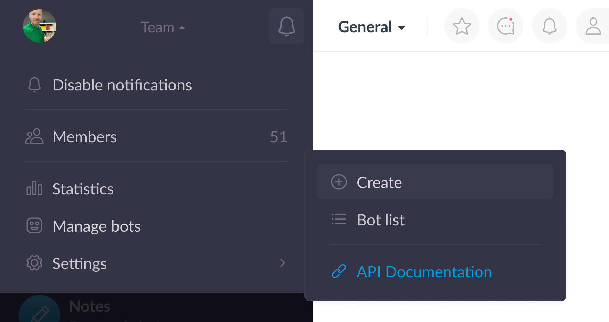
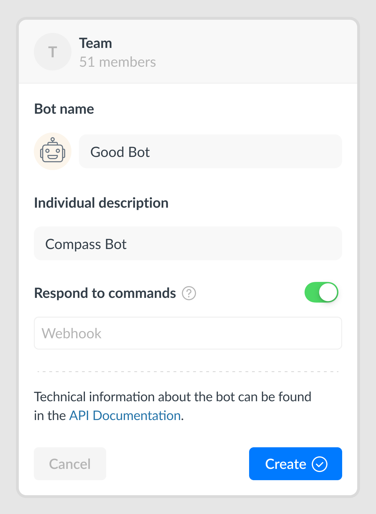
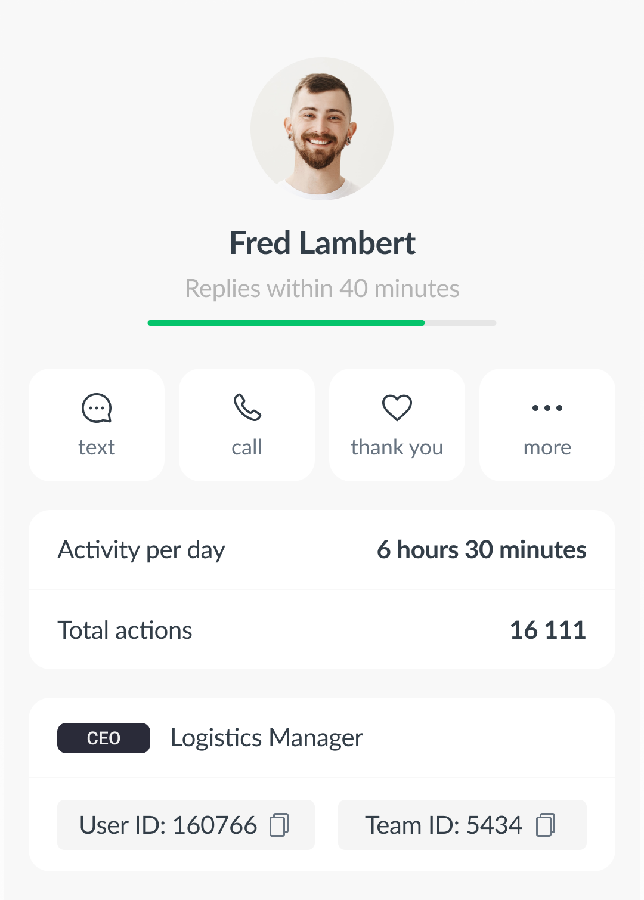
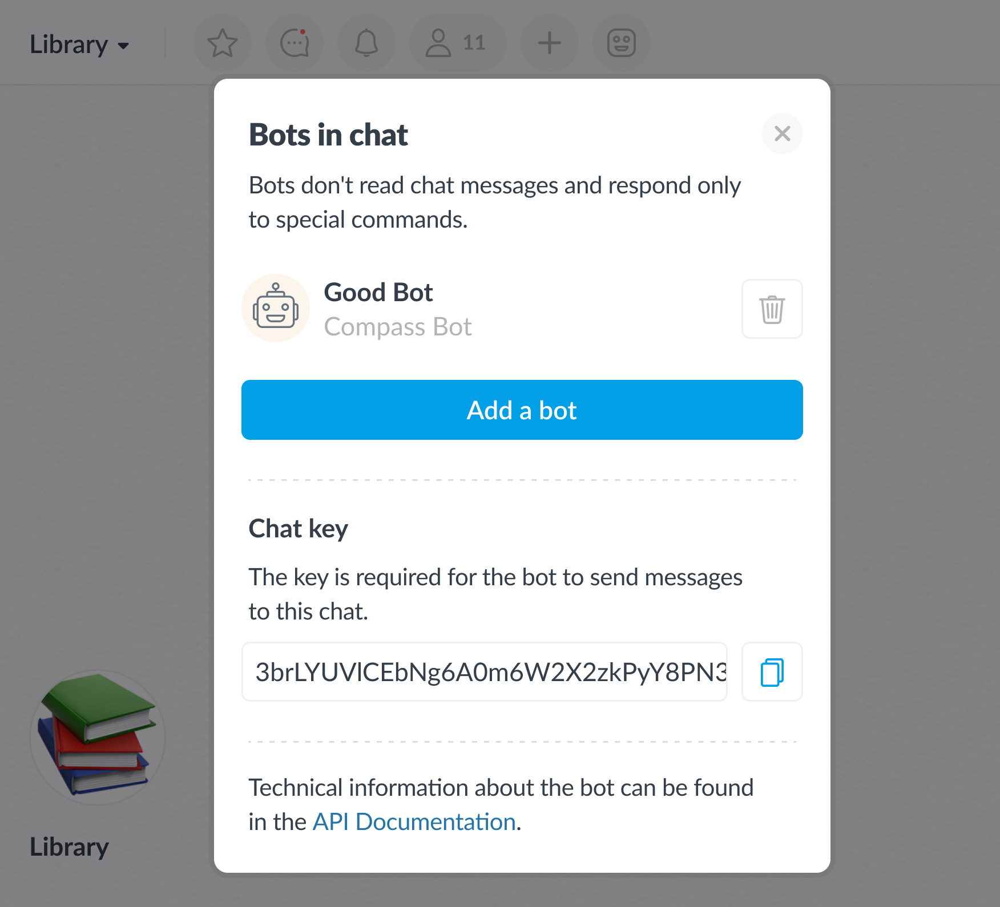
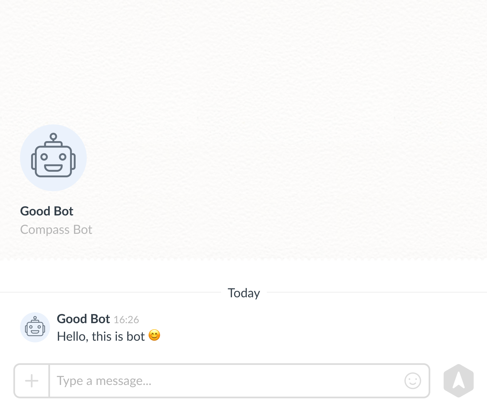
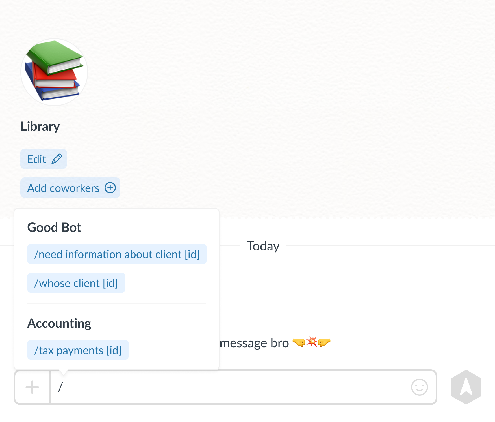

[](https://github.com/getCompass/userbot/blob/master/README.md)
[](https://github.com/getCompass/userbot/blob/master/README_ru.md)

- [Bot](#Bot)
- [Creating a bot](#Creating-a-bot)
  - [Bot credentials](#Bot-credentials)
- [Sending a request to Compass](#Sending-a-request-to-Compass)
  - [Scheme for obtaining a signature for the request](#Scheme-for-obtaining-a-signature-for-the-request)
  - [Response from Compass after sending a request](#Response-from-Compass-after-sending-a-request)
  - [Getting the result of the sent request](#Getting-the-result-of-the-sent-request)
- [Webhook and responding to commands](#Webhook-and-responding-to-commands)
  - [Bot Webhook version](#Bot-Webhook-version)
- [Compass Userbot API method list](#Compass-Userbot-API-method-list)
- [Additional message formatting](#Additional-message-formatting)
- [Errors in executing the Compass Userbot API request](#Errors-when-executing-the-Compass-Userbot-API-request)
- [Library for Compass Userbot API](#Library-for-working-with-the-Compass-Userbot-API)
## Bot ##

A bot is a special account in the Compass app created by the user to automatically perform customized actions.

What the Compass bot can do:
- send messages to private and group chats
- add reactions to messages
- send files to a chat
- collect basic information on workspace members (user_id, name, URL of the profile picture)

The actions listed above are implemented through special requests described below in “Compass Userbot API method list”.

Also, if you enable "Respond to commands" mode, the bot will start responding to commands that you specify and redirect them to your webhook address (more details about it below in “Webhook and responding to commands”).

## Creating a bot ##

Creating a bot is possible for an administrator with bot managing permission.

Only administrators can be given such permission in the workspace member settings. To give the permission go to "Members", select the administrator and then select "Set permissions".

|  |
|-----------------------------------------|

|   |
|-----------------------------------------|

After permissions are set, the sidebar will be updated and managing bot option will become available:

|   |
|------------------------------------------|

|   |
|------------------------------------------|

When creating a bot you may set the following parameters:
- bot name
- bot role
- webhook, where member commands will be redirected

Webhook is your service's URL. After setting it up, the bot is enabled to respond to the commands by redirecting them to the address you specified.

|   |
|-------------------------------------------|

#### Bot credentials
After creating a bot, you will get a **Token** and a **Signature Key** for the new bot (visible only to administrators with bot managing permission).

**The bot token** is a unique identifier for each bot.

|  |
|------------------------------------------|

**The signature key** is the key for generating a signature, which is used to sign each sent request. It is required to confirm that the request was sent from your bot.

|  |
|-------------------------------------------|

⚠️ Please note: **Your bot's Token and Signature Key** must not be given to third parties.

If you have already done it, it's better if you change the Signature key in the bot settings.

|  |
|------------------------------------------|

Thus, all bot requests that used the compromised signature key will become invalid for the Compass app.

## Sending a request to Compass ##

Requests to Compass Userbot API must be performed via HTTPS-request using POST method sent to endpoint: <br>
`https://userbot .getcompass.com/api/v2/` + (method being executed)<br>

All requests must be set with content type **application/json**.<br>
To upload files **multipart/form-data**.

The body of each request to Compass must contain the following:
- **json string** of required parameters for the request (empty if no data is required).

Request authorization is done via **headers** using your bot's token and generated signature:<br>
- header "**Authorization: bearer={bot token}**" - the header contains a token that belongs to your bot (the bot must be enabled for this);
- header "**Signature: signature={generated signature}**" - a signature is sent in the header to validate the request data (for more information, see below [Scheme for obtaining a signature for the request](#Scheme-for-obtaining-a-signature-for-the-request)).

All methods are case sensitive and must be UTF-8 encoded.

--- 

Let's look at a request using the example of sending a message to a member.

The  [/user/send](#post-usersend) method is used.<br>
URL for the request: `https://userbot.getcompass.com/api/v2/user/send` <br>

Example parameters for a request:
```json5
{
  "text": "Hello, this is bot", // any text for a new message from the bot 
  "type": "text", // indicate that the message is a text 
  "user_id": 12345 // the ID of the user to whom the message is sent
}
```

Curl-request structure:<br>
<pre style="white-space:pre-wrap;">
curl-X POST -d "<b>{parameters in json format}</b>"
-H "Content-Type: application/json"
-H "Authorization: bearer=<b>{bot token}</b>"
-H "Signature: signature=<b>{generated signature}</b>"
https://userbot.getcompass.com/api/v2/user/send
</pre>


---

The bot can send a message to the group it is a member of, a particular member, as well as in the comments to the message.

When sending a request, you need to specify where the message from the bot will be sent to:
- if you need to send it to a member, the member ID (the message receiver) is required
- if you need to send it to a group, you need a unique conversation key
- if you need to send it in comments, the message key to create a comment thread is required

#### Member ID

The member ID (the "user_id" parameter in requests) is used when sending a message to a specific member. You may get it from a member's profile in Compass (id is available for administrations with bot managing permission only):

|   |
|------------------------------------------|

#### Chat Key

Unique identifier of the group which the bot is a member of (used as "group_id" in requests).<br>
It is available to members with the permission to manage bots in the "Bot settings" section in a group chat:

|   |
|------------------------------------------|

Example of a chat key:

> 3brLYUVlCEbNg6A0m6W2X2zkPyY8PN3Ijw6efI20gVJHGiy4xHOociXAmMh1o/i01gLTS8wHHx7JGrrzIL4zDC6a4qX031dzJfqTzl8MD6Rqv2wd38yfGLS6n6VlwmPQ2hNNXCDPEL9sddmYCfHSSY/BfjXsNvJh3YpBH1pRf1I=

#### Message Key

The identifier of a message (used as "message_id" in requests) that the bot is working with. Example of a message key:
> oDT9FLRWjDOX0+4smgkCn039jKIce+NUE90zy9neDKvh6ubLMDGU/Cee5e07avTPFT/WcnAJIXFxBYmT8vqbF5vNIi4T/YEKZh4yF4iLXo9J4pW/4UguVkB0XY9/vF5pzUHUL4eVr3ScGWEP3fUEWdNlws+pffgp9oUOl+X0HrFxXxuFVfREy6od/psN+lob

---

#### Scheme for obtaining a signature for the request ####

To get a signature, follow these steps:

- for example, let's take a request to send a message from a bot to a specific member (the [/user/send](#post-usersend) method);
- specifying parameters and values for the request body:
>```json5  
>{
>    "user_id": 12345,
>    "text": "Hello, this is bot",
>    "type": "text"
>}
>```
- converting the transmitted data to json format;
- getting a json string of the following type: `{"user_id":12345,"text":"Hello, this is bot","type":"text"}`;
- combining bot token and json string: `<bot token> + <received json string>`;
- after that, use the function to generate a hash string based on the encryption key using the HMAC hashing method and the SHA256 encryption algorithm.<br>
>**hash_hmac("sha256", <bot token> + <received json string>, <your bot's signature key>)**
>- hash_hmac is a function for generating a hash string based on your bot's signature key;
>- sha256 — the encryption algorithm used;

Received string is a signature which is sent in a header of the request:<br>
**Signature: signature={generated signature}**:

⚠️ Pay attention to the following:
- the received signature is **relevant only** for the current token, signature key, and request parameters. If one of them changes, it will be necessary
  to generate the signature again according to the same scheme.

---

#### Response from Compass after sending a request ####

The response is a json object that contains the fields:
- **status** (string) — shows the status of the request.<br>
  Can take a value of "ok" (in case of success) or "error" (in case of an error);
- **response** (json) is a json object of arbitrary data.

In case of success, the response field may have the data of the executed request, or an empty value.

**Example of a response with returned data:**
```json5 
{
    "status": "ok",
    "response": {
        "request_id": "fb32d289-2ec2-46b7-8116-ad3c4adeaa61"
    }
}
```

**Example of an empty response:**
```json5 
{
    "status": "ok",
    "response": {}
}
```

If an error occurs the field **status** acquires the "error" value.<br>
In this case **response** field will contain the following fields:
- **error_code** (int) — error code. For more details, see below ["Errors when executing the Compass Userbot API request"](#Errors-when-executing-the-Compass-Userbot-API-request);
- **message** (string) — arbitrary error text.

**Example of an error response:**
```json5 
{
    "status": "error",
    "response": {
        "error_code": 1000,
        "message": "invalid parameters: not passed param text for request"
    }
}
```

#### Getting the result of the sent request ####

All the requests to Compass except for [/request/get](#post-requestget) method and file uploading are performed asynchronously.<br>
After executing the request it is necessary to request it using the identifier - `request_id`. 
This is the unique identifier of the performed request in Compass.

After successfully sending a request to Compass, you can request the result with a 0.5 seconds interval using the [/request/get](#post-requestget) method.<br>

Let's look at the scheme of getting the result by the example of sending a message from a bot:
- performing the [/user/send](#post-usersend) method, request by sending the text: Hello, this is bot :blush:
- the request response will contain its `request_id`:
```json5 
{
    "status": "ok",
    "response": {
        "request_id": "fb32d289-2ec2-46b7-8116-ad3c4adeaa61"
    }
}
```
- at this moment, the request is taken for processing to send a message to the member on behalf of the bot;
- calling the [/request/get](#post-requestget) method with sending `request_id` will return the state of the specified request:
> If the request is still in progress:
>
>```json5 
>{
>    "status": "error",
>    "response": {
>        "error_code": 7,
>        "message": "the request has not yet been completed, please try again in a while"
>    }
>}
>```
- such a response means that the request has not been executed yet — it is enough to wait a little (we recommend an interval of no more than 0.5 seconds), then re-request the result using [/request/get](#post-requestget);
- if the message is successfully sent, the method will return the result of executing the request — in this example, it is the `message_id` of the message sent by the bot:
>```json5
>{
>     "status": "ok",
>     "response": {
>          "message_id": "eNb2VLAPCGFfK1gHzNkH78XNDsPr9N/dDI7f/yaeTof0zjXwv/G000SZFNwqBOx2ACjqSwFjB1Lhgtqn..."
>     }
>}
>```

|   |
|------------------------------------------|

## Webhook and responding to commands

Bot may respond to special commands added by the workspace administrator with the bot managing permission using the method [/command/update](#post-commandupdate):

|   |
|------------------------------------------|

The preset commands will be visible to each workspace member in the "Bot Card" section:

|   |
|------------------------------------------|

When a member sends a command to a bot with "Respond to commands" mode enabled, and a webhook is installed, the data of the following form is sent to the specified address:

> If the command was sent in a group chat
>
>```json5 
>{
>    "group_id": "3brLYUVlCEbNg6A0m6W2X2zkPyY8PN3Ijw6efI20gVJHGiy4xHOociXAmMh1o/i01gLTS8wHHx7JGrrzIL4z...",
>    "message_id": "oDT9FLRWjDOX0+4smgkCn039jKIce+NUE90zy9neDKvh6ubLMDGU/Cee5e07avTPFT/WcnAJIXFxBYmT8vqbF5vNIi4T/YEKZh...",
>    "text": "/show command list"
>    "type": "group",
>    "user_id": 12345,
>}
>```

- group_id is for the key of the group chat where the command was sent from
- message_id is for the unique identifier of the command
- text is for the text of the command sent to the bot
- type indicates where the command came from (single — private chat with the bot; group — group chat)
- user_id — identifier of the member who sent the command

> If the command was sent in a private chat with the bot
>
>```json5 
>{
>     "group_id": "",
>     "message_id": "oDT9FLRWjDOX0+4smgkCn039jKIce+NUE90zy9neDKvh6ubLMDGU/Cee5e07avTPFT/WcnAJIXFxBYmT8vqbF5vNIi4T/YEKZh...",
>     "text": "/show command list"
>     "type": "single",
>     "user_id": 12345,
>}
>```

⚠️ Please note: only those messages are sent to your service, the text of which matches the template of commands prescribed in your workspace bot settings. **Other messages from the chat are not sent to the webhook**.

The request will be signed with a header using the token of the bot to which the sent command belongs:<br>
>header "**Authorization: bearer={bot token}**".<br>

The request will also contain a header with the generated signature for the data being sent (created according to the standard [Scheme for obtaining a signature for the request](#receipt-scheme)):<br>
>header "**Signature: signature={generated signature}**".<br>

After receiving the data on your webhook, you can:
- check by token that the request came to your bot
- generate a signature, then compare it with the hash string in the "Signature" header. If the strings match, you can thereby make sure that the data was sent from Compass, and not by third parties.

#### Bot Webhook version

Each Compass bot has a webhook version that allows for more flexible interaction with the Userbot API when API changes.<br>

Let's look at the example:<br>
In the new version of the Userbot API, the format of data sent to your webhook address has changed, for example, a new chat type has appeared:
>type: "group/single/ **(new) channel**"

In this case previously used bot will have a webhook version **not affected** by changes and your webhook address will get known format data.<br>
After you take new changes into consideration you may change the webhook version to the relevant one using the [/webhook/setVersion](#post-webhooksetversion) method.

## Compass Userbot API method list

| Method | What is it used for                                |
| :--- |:---------------------------------------------------|
| [/request/get](#post-requestget) | getting the result of executing the request         |
| [/user/send](#post-usersend) | sending a message from the bot to a specific member |
| [/group/send](#post-groupsend) | sending a message from the bot to a group chat     |
| [/thread/send](#post-threadsend) | sending a message from the bot to a comment thread         |
| [/message/addReaction](#post-messageaddreaction) | adding a reaction to a message on behalf of the bot |
| [/message/removeReaction](#post-messageremovereaction) | removing the bot's reaction from the message                  |
| [/user/getList](#post-usergetlist) | getting data about the workspace members           |
| [/group/getList](#post-groupgetlist) | getting the data of the groups that the bot is a member of      |
| [/command/update](#post-commandupdate) | updating the list of bot commands                       |
| [/command/getList](#post-commandgetlist) | getting a list of bot commands                       |
| [/webhook/setVersion](#post-webhooksetversion) | setting up the version for the bot webhook |
| [/webhook/getVersion](#post-webhookgetversion) | getting the current version of the bot webhook              |
| [/file/getUrl](#post-filegeturl) | getting the URL for uploading files                  |

## Description of methods

### `POST /request/get`

The method for getting the result of the sent request.<br>
URL for the request: `https://userbot.getcompass.com/api/v2/request/get` <br>

In case of success the result of the request will be returned.<br>
The following parameters must be specified in the request body:

| Name | Type | Property | Description | 
| -------- | --- | --- | -------- |
| request_id | string | required | ID of the request sent to the Compass app. |

<details><summary>Data example for the request body and the executing result</summary>
<br>

Data for the request body:
```json5 
{"request_id": "2f991a80-750c-4abc-b7e1-1f16456de59d"}
```

The result of executing the request (for example, information about the workspace participants was requested)
```json5 
{
     "status": "ok",
     "response": {
          "user_list": [
               {
                    "user_id": 1,
                    "user_name": "John Dow",
                    "avatar_file_url": ""
               },
               {
                    "user_id": 2,
                    "user_name": "Mike Johnson",
                    "avatar_file_url": "https://file-1.getcompass.com/files/pivot/dca/e8d/632/fa7/51f/fdcaee3ecea91e6c_w400.jpeg"
               }
          ]
     }
}
```

</details>

List of possible errors:

| error_code | Meaning |
| --- | --- |
| 7 | The request has not been completed yet, please try again after a while. |
| 1000 | Incorrect data was transferred (for example, the request_id parameter, which is not found in the database). |

---

### `POST /user/send`

A method for sending a message from a bot to a user.<br>
URL for the request: `https://userbot.getcompass.com/api/v2/user/send`

The following parameters must be specified in the request body:

| Name | Type | Property | Description |
| -------- | --- | --- | -------- |
| user_id | int | required | The ID of the member who the bot will send a message to in a private chat.|
| text | string | required if the file_id parameter is not transferred | Bot message text. |
| file_id | string | required if the text parameter is not transferred | The file identifier for a file message.<br> See more about file_id in ["POST /file/getUrl"](#post-filegeturl) below. |
| type | string | required | For text messages parameter = "text" is required. For files parameter = "file" is required. |

The method's response will return the `request_id` of the request that is executed asynchronously. The result of the execution can be received by using the [/request/get](#post-requestget) method.

The result of the method is:<br>
message_id (string) — message key sent by the bot.

<details><summary>Data example for the request body and the executing result</summary>
<br>

Data for the request body:
```json5 
{
     "text": "Hi, this is a message from a bot",
     "type": "text",
     "user_id": 12345
}
```

Request execution result:
```json5 
{
     "status": "ok",
     "response": {
          "message_id": "eNb2VLAPCGFfK1gHzNkH78XNDsPr9N/dDI7f/yaeTof0zjXwv/G000SZFNwqBOx2ACjqSwFjB1Lhgtqn..."
     }
}
```

</details>

List of possible errors:

| error_code | Meaning |
| --- | --- |
| 7 | The request has not been completed yet, please try again after a while. |
| 1000 | Incorrect data were sent (for example, one of the parameters was not transmitted). |
| 1001 | Selected member is not found in the workspace. |
| 1002 | Selected member has left the workspace. |

---

### `POST /group/send`

The method for sending a bot's message in a group chat.<br>
URL for the request: `https://userbot.getcompass.com/api/v2/group/send`

The following parameters must be specified in the request body:

| Name | Type | Property | Description |
| -------- | --- | --- | -------- |
| group_id | string | required | ID of the group where the bot will send the message. |
| text | string | required if the file_id parameter is not transferred | Bot message text. |
| file_id | string | required if the text parameter is not transferred | the file identifier for a file message.<br> See more about file_id in [“POST /file/getUrl”](#post-filegeturl) below. |
| type | string | required | For text messages parameter = "text" is required. For files parameter = "file" is required. |

The method's response will return the `request_id` of the request that is executed asynchronously. The result of the execution can be received by using the [/request/get](#post-requestget) method.

The result of the execution can be received by using the method<br>
message_id (string) — message key sent by the bot in a group chat.

<details><summary>Data example for the request body and the executing result</summary>
<br>

Data for the request body:
```json5 
{
     "group_id": "GrrzIL4zDC6a4qX031dzJfqTzl8MD6Rqv2wd38yfGLS6n3brLYUVlCEbNg6A0m6W2X2zkPyY8PN3Ijw6e...",
     "text": "Hi, this is a message from a bot to a group",
     "type": "text"
}
```

The result of completing the request:
```json5 
{
     "status": "ok",
     "response": {
          "message_id": "eNb2VLAPCGFfK1gHzNkH78XNDsPr9N/dDI7f/yaeTof0zjXwv/G000SZFNwqBOx2ACjqSwFjB1LhgtqnmXFReGjz..."
     }
}
```

</details>

List of possible errors:

| error_code | Meaning |
| --- | --- |
| 7 | The request has not been completed yet, please try again after a while. |
| 1000 | Incorrect data were sent (for example, one of the parameters was not transmitted). |
| 1003 | The bot is not in a group chat. |
| 1004 | The group is not found. |

---

### `POST /thread/send`

The method for sending a bot's message in a comment thread.<br>
URL for the request: `https://userbot.getcompass.com/api/v2/thread/send`

The following parameters must be specified in the request body:

| Name | Type | Property | Description |
| -------- | --- | --- | -------- |
| message_id | string | required | The identifier of the command for which the comment thread will be created, if it has not been created before, and a message from the bot is sent to this thread. |
| text | string | required if the file_id parameter is not transferred | Bot message text. |
| file_id | string | required if the text parameter is not transferred | the file identifier for a file message.<br> See more about file_id in [“POST /file/getUrl”](#post-filegeturl) below. |
| type | string | required | For text messages parameter = "text" is required. For files parameter = "file" is required.|

The method's response will return the `request_id` of the request that is executed asynchronously. The result of the execution can be received by using the [/request/get](#post-requestget) method.<br>

The result of the method is:<br>
message_id (string) — message key sent by the bot in the comment thread.

<details><summary>Sample data for the request body and execution result</summary>
<br>

Data for the request body:
```json5 
{
     "message_id": "oDT9FLRWjDOX0+4smgkCn039jKIce+NUE90zy9neDKvh6ubLMDGU/Cee5e07avTPFT/WcnAJIXFx...",
     "text": "Hi, this is a message from a bot in the thread",
     "type": "text"
}
```

Request execution result:
```json5 
{
     "status": "ok",
     "response": {
          "message_id": "eNb2VLAPCGFfK1gHzNkH78XNDsPr9N/dDI7f/yaeTof0zjXwv/G000SZFNwqBOx2ACjqSwFj..."
     }
}
```

</details>

List of possible errors:

| error_code | Meaning |
| --- | --- |
| 7 | The request has not been completed yet, please try again after a while. |
| 1000 | Incorrect data were sent (for example, one of the parameters was not transmitted). |
| 1005 | The bot does not have access to the message (the message has been deleted or the chat has been cleared). |
| 1007 | The transmitted message ID is not found. |

---

### `POST /message/addReaction`

The method for adding bot's reactions to the message.<br>
URL for the request: `https://userbot.getcompass.com/api/v2/message/addReaction`

The Compass app supports a list of reactions of version 15.0: https://emojipedia.org/emoji-15.0/. <br>

The following parameters must be specified in the request body:

| Name | Type | Property | Description |
| -------- | --- | --- | -------- |
| message_id | string | required | Identifier of the message which bot's reaction is added to. |
| reaction | string | required | The necessary reaction. <br>May take the value:<br>- short_name. For example, `:blush:`<br>- emoji. For example, 😊 |

The method's response will return the `request_id` of the request that is executed asynchronously. The execution result can be obtained using the [/request/get](#post-requestget) method.<br>The
The result will be a standard "ok" response with no data inside.

<details><summary>Data example for the request body and the executing result</summary>
<br>

Data for the request body:
```json5 
{
     "message_id": "oDT9FLRWjDOX0+4smgkCn039jKIce+NUE90zy9neDKvh6ubLMDGU/Cee5e07avTPFT/WcnAJIXFxBYmT8v...",
     "reaction": ":blush:"
}
```

Request execution result:
```json5 
{
     "status": "ok",
     "response": {}
}
```

</details>

List of possible errors:

| error_code | Meaning |
| --- | --- |
| 7 | The request has not been completed yet, please try again after a while. |
| 1000 | Incorrect data were sent (for example, one of the parameters was not transmitted). |
| 1005 | The bot does not have access to the message (the message has been deleted or the chat has been cleared). |
| 1006 | The transmitted reaction is not found in the application. |
| 1007 | The transmitted message ID is not found. |

---

### `POST /message/removeReaction`

The method for removing reactions from messages.<br>
URL for the request: `https://userbot.getcompass.com/api/v2/message/removeReaction`

The Compass app supports a list of reactions of version 15.0: https://emojipedia.org/emoji-15.0/. <br>

The following parameters must be specified in the request body:

| Name | Type | Property | Description |
| -------- | --- | --- | -------- |
| message_id | string | required | Identifier of the message which the bot's reaction will be removed from. |
| reaction | string | required | The reaction needs to be removed.<br>May take the value:<br>- short_name. For example, `:blush:`<br>- emoji. For example, 😊  |

The method's response will return the `request_id` of the request that is executed asynchronously. The result of the execution can be received by using the [/request/get](#post-requestget) method.<br>
The result will be a standard "ok" response with no data inside.

<details><summary>Data example for the request body and the executing result</summary>
<br>

Data for the request body:
```json5 
{
     "message_id": "oDT9FLRWjDOX0+4smgkCn039jKIce+NUE90zy9neDKvh6ubLMDGU/Cee5e07avTPFT/WcnAJIXFxBYmT8v...",
     "reaction": ":blush:"
}
```

Request execution result:
```json5 
{
     "status": "ok",
     "response": {}
}
```

</details>

List of possible errors:

| error_code | Meaning |
| --- | --- |
| 7 | The request has not been completed yet, please try again after a while.|
| 1000 | Incorrect data were sent (for example, one of the parameters was not transmitted). |
| 1005 | The bot does not have access to the message (the message has been deleted or the chat has been cleared). |
| 1006 | The transmitted reaction is not found in the application. |
| 1007 | The transmitted message ID is not found. |

---

### `POST /user/getList`

The method for getting the data about the workspace members.<br>
URL for the request: `https://userbot.getcompass.com/api/v2/user/getList`

The following parameters can be used in the request body:

| Name | Type | Property | Description |
| -------- | --- | --- | -------- |
| count | int | _optional_ | The number of data in the response. Default = 100. Maximum = 300. |
| offset | int | _optional_ | Offset for data pagination. Default = 0. |

The method's response will return the `request_id` of the request that is executed asynchronously. The result of the execution can be received by using the [/request/get](#post-requestget) method.<br>
The result of the method is:<br>
user_list (array) — list with the data about workspace members.

<details><summary>Data example for the request body and the executing result</summary>
<br>

Data for the request body:
```json5 
{"count": 300, "offset": 0}
```

Request execution result:
```json5 
{
     "status": "ok",
     "response": {
          "user_list": [
               {
                    "user_id": 1,
                    "user_name": "John Dow",
                    "avatar_file_url": ""
               },
               {
                    "user_id": 2,
                    "user_name": "Mike Johnson",
                    "avatar_file_url": "https://file-1.getcompass.com/files/pivot/dca/e8d/632/fa7/51f/fdcaee3ecea91e6c_w400.jpeg"
               }
          ]
     }
}
```

</details>

List of possible errors:

| error_code | Meaning |
| --- | --- |
| 7 | Data example for the request body and the executing result |

---

### `POST /group/getList`

The method for getting the data about the groups the bot is a member of.<br>
URL for the request: `https://userbot.getcompass.com/api/v2/group/getList`

The following parameters can be used in the request body:

| Name | Type | Property | Description |
| -------- | --- | --- | -------- |
| count | int | _optional_ | The number of data in the response. Default = 100. Maximum = 300. |
| offset | int | _optional_ | Offset for data pagination. Default = 0. |

The method's response will return the `request_id` of the request that is executed asynchronously. The result of the execution can be received by using the [/request/get](#post-requestget) method.<br>
The result of the method is:<br>
group_list (array) — list with the data about the bot's group chats.

<details><summary>Data example for the request body and the executing result</summary>
<br>

Data for the request body:
```json5 
{"count": 50, "offset": 0}
```

Request execution result:
```json5 
{
     "status": "ok",
     "response": {
          "group_list": [
               {
                    "group_id": "kPyY8PN3Ijw6efI20gVJHGiy4xHOociXAmMh1o/i01gLTS8wHHx7JGrrzIL4zDC6a4qX031dzJfqTzl8MD6Rqv2wd38...",
                    "name": "Library",
                    "avatar_file_url": "https://file-1.getcompass.com/files/c1/cba/30i/de0/2ff/uf3/4128e05b1cbd1f79_w80.jpg"
               },
               {
                    "group_id": "GrrzIL4zDC6a4qX031dzJfqTzl8MD6Rqv2wd38yfGLS6n3brLYUVlCEbNg6A0m6W2X2zkPyY8PN3Ijw6efI20gVJHG...",
                    "name": "Schedule",
                    "avatar_file_url": "https://file-1.getcompass.com/files/c1/cde/b4s/duo/1fc/97t/4128e05b1cbd1f79_w80.jpg"
               },
               {
                    "group_id": "3brLYUVlCEbNg6A0m6W2X2zkPyY8OociXAmMh1o/i01gLTS8wHHx7JGrrzIL4zDC6a4qX031dzJfqTzl8MD6Rqv2wd...",
                    "name": "Statistics",
                    "avatar_file_url": "https://file-1.getcompass.com/files/c1/adf/a1e/pra/4ca/mt5/4128e05b1cbd1f79_w80.jpg"
               }
          ]
     }
}
```

</details>

List of possible errors:

| error_code | Meaning |
| --- | --- |
| 7 | The request has not been completed yet, please try again after a while. |

---

### `POST /command/update`

The method for updating a bot command list.<br>
URL for the request: `https://userbot.getcompass.com/api/v2/command/update`

The following parameters must be specified in the request body:

| Name | Type | Property | Description |
| -------- | --- | --- | -------- |
| command_list | array | required | A new list of command lines for the bot (maximum 30 commands for the bot). |

A few rules for setting commands:

- The length of the command must not exceed 80 characters.
- The command can have parameters enclosed in square brackets. In this case, the pattern for defining commands for the bot will "ignore" them during processing, treating them as a sent parameter. <br> For example, a bot command list includes the command: "send the message to the member [ID]". If the message "/send message to member [1666]" is sent to the chat, the parser will define it as a command. 
- Commands can contain Cyrillic and Latin alphabet symbols, numbers and an underscore. For example, /help, /client info [ID], /set_timer 10 min.

> /help
>
> /client info [ID]
>
> /set_timer 10min

The method's response will return the request_id of the request that is executed asynchronously. The result of the execution can be received by using the [/request/get](#post-requestget) method.<br>
The result will be a standard "ok" response with no data inside.

<details><summary>Data example for the request body and the executing result</summary>
<br>

Data for the request body:
```json5 
{
     "command_list": [
          "/help",
          "/send message to user [ID]"
     ]
}
```

Request execution result:
```json5 
{
     "status": "ok",
     "response": {}
}
```

</details>

List of possible errors:

| error_code | Meaning |
| --- | --- |
| 7 | The request has not been completed yet, please try again after a while. |
| 1000 | Incorrect data was transmitted (the length for the command was exceeded). |
| 1008 | The limit of the command list has been exceeded. |
| 1009 | Invalid command in the list. |

---

### `POST /command/getList`

The method for getting a bot command list.<br>
URL for the request: `https://userbot.getcompass.com/api/v2/command/getList`

Parameters are **not required** to be sent in the request body.

The method's response will return the `request_id` of the request that is executed asynchronously. The result of the execution can be received by using the [/request/get](#post-requestget) method.<br>
The result of the method is:<br>
command_list (array) — bot command list.

<details><summary>The example of the request</summary>

```json5 
{
     "status": "ok",
     "response": {
          "command_list": [
               "/help",
               "/send message to user [ID]"
          ]
     }
}
```

</details>

List of possible errors:

| error_code | Meaning |
| --- | --- |
| 7 | The request has not been completed yet, please try again after a while.|

---

### `POST /webhook/setVersion`

The method for setting the level of the bot webhook version.<br>
URL for the request: `https://userbot.getcompass.com/api/v2/webhook/setVersion`

The following parameters must be specified in the request body:

| Name | Type | Property | Description |
| -------- | --- | --- | -------- |
| version | int | required | The version number for the bot webhook. |

The method's response will return the `request_id` of the request that is executed asynchronously. The result of the execution can be received by using the [/request/get](#post-requestget) method.<br>
The result will be a standard "ok" response with no data inside.

<details><summary>Data example for the request body and the executing result</summary>
<br>

Data for the request body:
```json5 
{"version": 2}
```

Request execution result:
```json5 
{
     "status": "ok",
     "response": {}
}
```

</details>

List of possible errors:

| error_code | Meaning |
| --- | --- |
| 7 | The request has not been completed yet, please try again after a while. |
| 1000 | Incorrect data was transmitted. |
| 1011 | An incorrect version of the webhook was transmitted. |

---

### `POST /webhook/getVersion`

The method for getting the level of the bot webhook version.<br>
URL for the request: `https://userbot.getcompass.com/api/v2/webhook/getVersion`

Parameters are **not required** to be sent in the request body.

The result of the method is:<br>
version (int) — bot webhook version level.

<details><summary>The example of the request</summary>

```json5 
{
     "status": "ok",
     "response": {
          "version": 2
     }
}
```

</details>

---

### `POST /file/getUrl`

The method for getting the URL node where the files are uploaded.

It is used for further getting of file_id parameter for sending files.<br>
URL for the request: `https://userbot.getcompass.com/api/v2/file/getUrl`

Parameters are **not required** to be sent in the request body.

The method's response will return the `request_id` of the request that is executed asynchronously. The result of the execution can be received by using the [/request/get](#post-requestget) method.<br>
The result of the method is:<br>
node_url — server URL- address, where file upload is available;<br>
file_token — a token for validating the file upload.

<details><summary>The example of the request</summary>

```json5 
{
     "status": "ok",
     "response": {
          "node_url": "https://file1.getcompass.com/api/userbot/files/upload",
          "file_token": "404952d4ac90ae960de4d2a96fb95d306493e151"
     }
}
```

</details>

---

After receiving the server URL, it will be possible to upload the file as a composite request using [multipart/form-data](https://ru.wikipedia.org/wiki/Multipart/form-data), signing the request with the received file token.

In our case, with the node_url and file download token taken from the response, the request will look like this:<br>
URL for the request: `https://file1.getcompass.com/api/userbot/files/upload`

| Name | Type | Property | Description |
| -------- | --- | --- | -------- |
| token | string | required | A token for validating the file upload. |
| file | string/binary | required | The contents of the file to upload. |

⚠️ File upload restrictions:

- 256 MB is the maximum file size available
- one token allows uploading only one file and it's not possible to use it for uploading another one
- no more than 50 files are available for upload in 5 minutes

After a successful file loading (synchronous execution - the file will be loaded immediately) the response from the method will return:

file_id (string) — unique identifier of the loaded file.

<details><summary>The example of the result of completing the request</summary>

Request example:
```json5 
token: "404952d4ac90ae960de4d2a96fb95d306493e151", // value of the received file_token
file: "(binary)"                                   // binary data of the uploaded file
```

Request execution result:
```json5 
{
     "status": "ok",
     "response": {
          "file_id": "+OVV/dHD03Pb/qRQz9W/FhgupqO6UY0lmbwnG5tz9mHW51N8gA10VvotOzq01GuWq/c5LGZSldSCz4aki..."
     }
}
```

</details>

List of possible errors:

| error_code | Meaning |
| --- | --- |
| 7 | The request has not been completed yet, please try again after a while. |
| 1000 | Incorrect data was transmitted. |
| 1010 | Failed to load the file. |

---

### Additional message formatting

The function of mentioning a member is available to a bot.

|   |
|------------------------------------------|

To do this, the message text must have the format of:<br>
`["@"|<numeric identifier user_id>|<member name>|]`

With the example above, let's assume that Fred Smith has a member ID 345. To get the message like in the example the message test sent by the bot must be of the following format:<br>
`["@"|345|Fred Smith] data generated Insert tag (Option+1)✅`

---

The bot has the same message formatting abilities as a workspace member in Compass.<br>

For example, you can change the typeface or highlight words in a certain color:
- bold text font: *bold font*
- italics in the text: _cursive_
- strikethrough text: \~strikethrough text\~
- text on a black background: \`text on a black background\`
- text highlighted in green: \++green selection\++
- text highlighted in pink: \--pink selection\--

|   |
|------------------------------------------|


## Errors when executing the Compass Userbot API request

If an error occurred during the execution of the request, the response is returned in the following format:

```json5 
{
     "status": "error",
     "response": {
          "error_code": 1,
          "message": "missing required fields for request"
     }
}
```
- status "error" notifies that the request failed with an error
- error_code is for special error code
- message is for any text to describe the error

---

Here is the list of **system errors** that are displayed when invalid data is transmitted and when the request has not yet been executed.

| error_code | Meaning |
| --- | --- |
| 1 | There are no fields required for the request. |
| 2 | The request token is not found. |
| 3 | The bot is disabled or deleted — the request cannot be completed. |
| 4 | Invalid signature for validating the transmitted data. |
| 5 | You have reached the limit of errors when completing the request. |
| 6 | Unknown error when executing an internal method for the request. |
| 7 | The request has not been completed yet, please try again after a while. |
| 8 | Invalid parameters for the request are specified. |
| 9 | Invalid request method is specified. |

---

Here is the **list of errors** that are displayed when a request fails, for example, when trying to write on behalf of a bot to a user who has deleted an account in the app.

| error_code | Meaning |
| --- | --- |
| 1000 | Incorrect data was transmitted. |
| 1001 | Selected member is not found in the workspace. |
| 1002 | Selected member has left the workspace |
| 1003 | The bot is not in a group chat. |
| 1004 | The group is not found. |
| 1005 | The bot does not have access to the message (the message has been deleted or the chat has been cleared). |
| 1006 | The transmitted reaction is not found in the application. |
| 1007 | The transmitted message ID is not found. |
| 1008 | The limit of the command list has been exceeded. |
| 1009 | Invalid command in the list. |
| 1010 | Failed to load the file. |
| 1011 | An incorrect version of the webhook was transmitted. |

## Library for working with the Compass Userbot API

For your convenience, we have created the Library for working with the Compass app Userbot API:<br>
[A library for interacting with the Compass Userbot API](https://github.com/getCompass/php_lib_userbot). <br>
